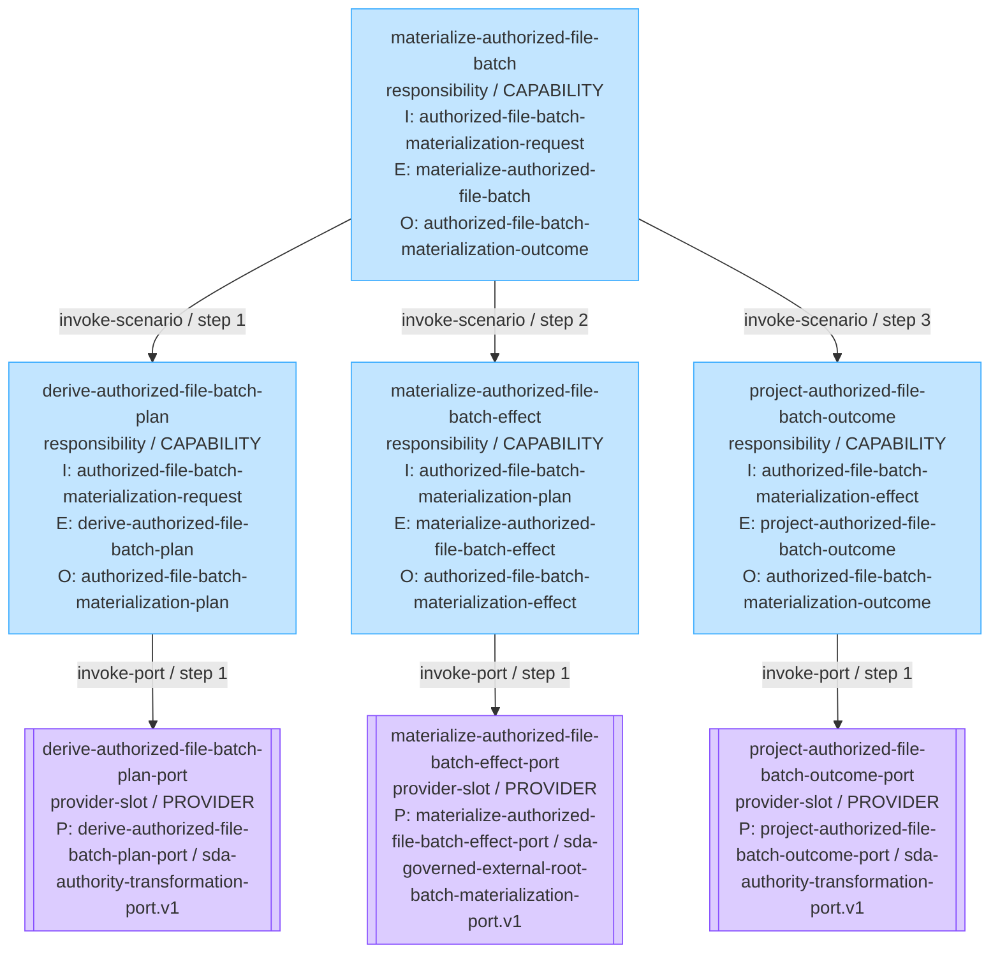
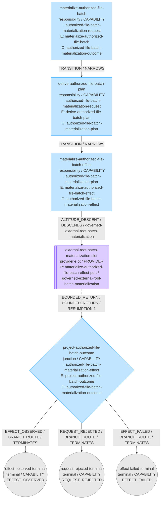
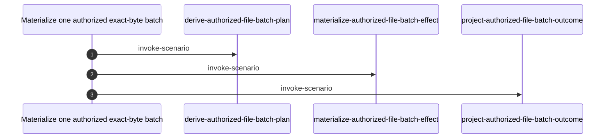

# materialize-authorized-file-batch

> materialize a non-empty ordered batch of content-addressed bytes beneath one explicitly supplied external root

## Identity

| Field | Value |
| --- | --- |
| Capability | materialize-authorized-file-batch |
| Namespace | sidefx:capabilities |
| Mode | capability |
| Declared root scenario | materialize-authorized-file-batch |
| Definition digest | `sha256:cac5c81db11414eab6f9924bac4c2995ff66bbdca7000903c782c890171b0650` |
| Snapshot | `sha256:1a770ac0795d10665a88166f8d8c968dc5b2d030fdfab2b837aa6071d135f9e9` |
| Projection | `sha256:8aae1f306ced5952333da0fb936d2f846081f8ed31b6f627a2099ad49cbbfdb0` |

## Review summary (1 observation)

Each line states what the selected model declares. None is a judgement about
whether the estate is correct - that is the reviewer's to make.

**Meaning — the authority declares none here (1)**

| Subject | Observation | Code |
| --- | --- | --- |
| `materialize-authorized-file-batch` | The CANONICAL binding is `retained-feature-binding.v1`, which declares no feature name or narrative; the parsed declaration is retained on `parsed-feature-declaration.v1`, which this generation does not bind canonically. | `CANONICAL_FEATURE_DECLARATION_ABSENT` |

## Capability circuit today

The circuit the estate declares now, drawn in the same shape a blueprint is drawn in,
so the two can be read against each other. Node shape is the declared kind, the label lines
are the declared face, and each edge caption is the declared operation kind and its step in
the declared order. A node in red is a point the review summary names.



## Blueprint candidate (1)

### `materialize-authorized-file-batch-blueprint.v1`

| Field | Value |
| --- | --- |
| Carrier | canonical-circuit-blueprint.v1 |
| Blueprint version | 0.1.0 |
| Root experience | authorized-exact-byte-batch-materialization |
| Definition digest | `sha256:7d8f25bc06b90e915abb462ee86930e9ace7df98e7dd875af3800289487bf0fa` |
| Declared nodes | 8 |
| Declared edges | 7 |

Generated from the retained blueprint authority on every read, not from a
pre-rendered artifact. Node shape is the declared kind; every edge caption is the
declared selecting variant, topology, semantic progress and bounded return.



#### Proposed against today

**Cells and scenarios**

| Standing | Count | Declared |
| --- | --- | --- |
| Proposed and present today | 4 | `derive-authorized-file-batch-plan`, `materialize-authorized-file-batch`, `materialize-authorized-file-batch-effect`, `project-authorized-file-batch-outcome` |
| Proposed as a cell, no scenario of that name in today's closure | 0 | none |
| In today's closure, not proposed as a cell | 0 | none |

**Ports**

| Standing | Count | Declared |
| --- | --- | --- |
| Proposed and present today | 1 | `materialize-authorized-file-batch-effect-port` |
| Proposed as a provider slot, not a port today | 0 | none |
| A port today, not proposed as a provider slot | 2 | `derive-authorized-file-batch-plan-port`, `project-authorized-file-batch-outcome-port` |

A name on one side only is reported as exactly that. Which side is right is the
reviewer's to decide.

## Execution order

The declared operation sequence for `materialize-authorized-file-batch`, in the order the
execution authority declares it.



## Canonical feature (2)

| Profile | Binding | Retained source | Source bytes | Pinned scenarios |
| --- | --- | --- | --- | --- |
| `parsed-feature-declaration.v1` | generation-scoped | `features/materialize-authorized-file-batch.feature` | `sha256:8cf7141cb96bf97f94a8401951402175582a9b408935acf2792045a7bfef2081` | 4 |
| `retained-feature-binding.v1` | CANONICAL | `features/materialize-authorized-file-batch.feature` | `sha256:8cf7141cb96bf97f94a8401951402175582a9b408935acf2792045a7bfef2081` | 4 |

### Materialize one authorized batch of exact file bytes

A caller supplies one disposable external-root authority and a non-empty ordered
batch of content-addressed file mappings. The capability derives one canonical
authorized plan, delegates exactly that plan to an admitted generic filesystem
mechanic, and returns bounded post-effect testimony for every mapping.
The capability is domain-neutral. It knows nothing about capsules, expansion,
Reveal, repositories, projectors, or any consumer-specific layout. It neither
discovers a destination nor grants authority to one. The caller supplies the
target root, relative target paths, exact base64 bytes, expected SHA-256 digests,
and per-target existence policy.
Absolute paths, traversal, symbolic-link crossings, malformed or divergent byte
testimony, duplicate or colliding targets, incompatible existing targets, and
post-effect digest divergence fail closed. The complete batch is validated before
the target root is created or any file is written. Repeating an exact authorized
request is idempotent only where allow-exact-match is explicitly declared.
Success reports file paths, byte lengths, content hashes, per-mapping results,
and effect lineage without returning encoded content bytes. REQUEST_REJECTED and
EFFECT_FAILED remain distinct from EFFECT_OBSERVED and never claim completion.

## User story

| Field | Declared |
| --- | --- |
| Actor | authorized caller |
| Intent | materialize a non-empty ordered batch of content-addressed bytes beneath one explicitly supplied external root |
| Outcome | receive bounded per-file post-effect testimony without encoded content retention or downstream semantic claims |

## Experience

| Field | Declared |
| --- | --- |
| Actor | authorized caller |
| Experience | authorized-exact-byte-batch-materialization.v1 |
| Promise | derive one canonical plan, execute it through the admitted generic provider, and preserve the provider terminal partition |

## Observable conditions (6)

- `batch-order-is-preserved`
- `plan-identity-is-canonical`
- `post-effect-hashes-match`
- `raw-encoded-content-is-not-returned`
- `request-rejection-remains-distinct-from-effect-failure`
- `whole-batch-validation-precedes-effect`

## Scenario closure (4)

The model declares 3 scenario invocations as relationships between these scenarios.

## Scenarios

### Materialize one authorized exact-byte batch

| Field | Value |
| --- | --- |
| Scenario | `materialize-authorized-file-batch` |
| Depth | 0 (the scenario read) |
| Retained definitions | 1 |

```gherkin
Scenario: Materialize one authorized exact-byte batch
  Given one caller-authorized disposable external root and one non-empty ordered batch of exact content-addressed file mappings
  When a canonical plan is derived, the admitted external-root materialization mechanic is invoked once, and its bounded testimony is projected
  Then return EFFECT_OBSERVED, REQUEST_REJECTED, or EFFECT_FAILED with exact per-mapping evidence and no encoded content bytes
```

Tags: `@scenario:materialize-authorized-file-batch`, `@input:authorized-file-batch-materialization-request`, `@input-contract:authorized-file-batch-materialization-request.v1`, `@event:materialize-authorized-file-batch`, `@event-authority:materialize-authorized-file-batch.v1`, `@outcome:authorized-file-batch-materialization-outcome`, `@outcome-contract:authorized-file-batch-materialization-outcome.v1`, `@outcome-variants:EFFECT_OBSERVED|REQUEST_REJECTED|EFFECT_FAILED`, `@outcome-terminal`

### Derive one canonical content-addressed plan

| Field | Value |
| --- | --- |
| Scenario | `derive-authorized-file-batch-plan` |
| Depth | 1 |
| Retained definitions | 1 |

```gherkin
Scenario: Derive one canonical content-addressed plan
  Given one contract-admitted request containing a target-root reference, ordered mappings, exact encoded bytes, declared hashes, existence policy, and request lineage
  When the provider request, ordered operations, and canonical plan identity are derived
  Then return one AUTHORIZED content-addressed plan and bounded provider request without claiming any filesystem effect
```

Tags: `@scenario:derive-authorized-file-batch-plan`, `@input:authorized-file-batch-materialization-request`, `@input-contract:authorized-file-batch-materialization-request.v1`, `@event:derive-authorized-file-batch-plan`, `@event-authority:derive-authorized-file-batch-plan.v1`, `@outcome:authorized-file-batch-materialization-plan`, `@outcome-contract:authorized-file-batch-materialization-plan.v1`, `@outcome-variants:PLAN_AUTHORIZED`

### Execute only the authorized plan at the caller root

| Field | Value |
| --- | --- |
| Scenario | `materialize-authorized-file-batch-effect` |
| Depth | 1 |
| Retained definitions | 1 |

```gherkin
Scenario: Execute only the authorized plan at the caller root
  Given one authorized plan and one caller-supplied external-root reference
  When the admitted governed external-root batch materialization mechanic is invoked exactly once
  Then return bounded per-operation effect testimony and post-effect hashes without returning encoded content bytes or adding semantic authorization
```

Tags: `@scenario:materialize-authorized-file-batch-effect`, `@input:authorized-file-batch-materialization-plan`, `@input-contract:authorized-file-batch-materialization-plan.v1`, `@event:materialize-authorized-file-batch-effect`, `@event-authority:materialize-authorized-file-batch-effect.v1`, `@outcome:authorized-file-batch-materialization-effect`, `@outcome-contract:authorized-file-batch-materialization-effect.v1`, `@outcome-variants:EFFECT_OBSERVED|REQUEST_REJECTED|EFFECT_FAILED`

### Project bounded materialization testimony

| Field | Value |
| --- | --- |
| Scenario | `project-authorized-file-batch-outcome` |
| Depth | 1 |
| Retained definitions | 1 |

```gherkin
Scenario: Project bounded materialization testimony
  Given one exact provider testimony with plan, operation, failure, and effect lineage evidence
  When consumer-facing outcome authority is projected
  Then preserve the terminal disposition and bounded evidence while excluding encoded content bytes and any capsule, repository, or downstream completion claim
```

Tags: `@scenario:project-authorized-file-batch-outcome`, `@input:authorized-file-batch-materialization-effect`, `@input-contract:authorized-file-batch-materialization-effect.v1`, `@event:project-authorized-file-batch-outcome`, `@event-authority:project-authorized-file-batch-outcome.v1`, `@outcome:authorized-file-batch-materialization-outcome`, `@outcome-contract:authorized-file-batch-materialization-outcome.v1`, `@outcome-variants:EFFECT_OBSERVED|REQUEST_REJECTED|EFFECT_FAILED`, `@outcome-terminal`

## Execution plan (4 declared execution authorities)

### `derive-authorized-file-batch-plan.v1`

| Field | Value |
| --- | --- |
| Owning scenario | derive-authorized-file-batch-plan |
| Retained definitions | 1 |

```text
derive-authorized-file-batch-plan.v1
`-- 1. invoke-port --> derive-authorized-file-batch-plan-port
    |-- platform capability: sda-authority-transformation-port.v1
    `-- transformation: derive-authorized-file-batch-plan.v1
```

### `materialize-authorized-file-batch.v1`

| Field | Value |
| --- | --- |
| Owning scenario | materialize-authorized-file-batch |
| Retained definitions | 1 |

```text
materialize-authorized-file-batch.v1
|-- 1. invoke-scenario --> derive-authorized-file-batch-plan
|-- 2. invoke-scenario --> materialize-authorized-file-batch-effect
`-- 3. invoke-scenario --> project-authorized-file-batch-outcome
```

### `materialize-authorized-file-batch-effect.v1`

| Field | Value |
| --- | --- |
| Owning scenario | materialize-authorized-file-batch-effect |
| Retained definitions | 1 |

```text
materialize-authorized-file-batch-effect.v1
`-- 1. invoke-port --> materialize-authorized-file-batch-effect-port
    |-- platform capability: sda-governed-external-root-batch-materialization-port.v1
    `-- transformation: (not declared)
```

### `project-authorized-file-batch-outcome.v1`

| Field | Value |
| --- | --- |
| Owning scenario | project-authorized-file-batch-outcome |
| Retained definitions | 1 |

```text
project-authorized-file-batch-outcome.v1
`-- 1. invoke-port --> project-authorized-file-batch-outcome-port
    |-- platform capability: sda-authority-transformation-port.v1
    `-- transformation: project-authorized-file-batch-outcome.v1
```

## Transformations (2)

| Transformation | Retained definitions | Declared expression keys |
| --- | --- | --- |
| `derive-authorized-file-batch-plan.v1` | 1 | bindings, op, value |
| `project-authorized-file-batch-outcome.v1` | 1 | fields, op |

## Mechanics (17)

4 providers declare an implementation of these ports' platform capabilities.

| Provider | Mechanic | Definition profile | Via platform capability |
| --- | --- | --- | --- |
| `ScenarioKernel.Adapters.Consumer.SemanticTransformationEngine` | `authority-driven-transformation` | sda-platform-provided-mechanic.v1 | `sda-authority-transformation-port.v1` |
| `ScenarioKernel.Adapters.Consumer.SemanticTransformationEngine` | `event-port-invocation` | sda-platform-provided-mechanic.v1 | `sda-authority-transformation-port.v1` |
| `ScenarioKernel.Adapters.Consumer.SemanticTransformationEngine` | `state-projection` | sda-platform-provided-mechanic.v1 | `sda-authority-transformation-port.v1` |
| `ScenarioKernel.Adapters.Consumer.SemanticTransformationEngine` | `transition-binding-projection` | sda-platform-provided-mechanic.v1 | `sda-authority-transformation-port.v1` |
| `ScenarioKernel.NodePlatform.Execution.AuthorityTransformation` | `authority-driven-transformation` | sda-platform-provided-mechanic.v1 | `sda-authority-transformation-port.v1` |
| `ScenarioKernel.NodePlatform.Execution.AuthorityTransformation` | `event-port-invocation` | sda-platform-provided-mechanic.v1 | `sda-authority-transformation-port.v1` |
| `scenario_kernel.adapters.SemanticTransformationEngine` | `authority-driven-transformation` | sda-platform-provided-mechanic.v1 | `sda-authority-transformation-port.v1` |
| `scenario_kernel.adapters.SemanticTransformationEngine` | `event-port-invocation` | sda-platform-provided-mechanic.v1 | `sda-authority-transformation-port.v1` |
| `scenario_kernel.adapters.SemanticTransformationEngine` | `state-projection` | sda-platform-provided-mechanic.v1 | `sda-authority-transformation-port.v1` |
| `scenario_kernel.adapters.SemanticTransformationEngine` | `transition-binding-projection` | sda-platform-provided-mechanic.v1 | `sda-authority-transformation-port.v1` |
| `ScenarioKernel.NodePlatform.Effects.GovernedExternalRootBatchMaterialization` | `byte-exact-base64-decoding` | sda-platform-provided-mechanic.v1 | `sda-governed-external-root-batch-materialization-port.v1` |
| `ScenarioKernel.NodePlatform.Effects.GovernedExternalRootBatchMaterialization` | `caller-authorized-external-root` | sda-platform-provided-mechanic.v1 | `sda-governed-external-root-batch-materialization-port.v1` |
| `ScenarioKernel.NodePlatform.Effects.GovernedExternalRootBatchMaterialization` | `content-addressed-batch-materialization` | sda-platform-provided-mechanic.v1 | `sda-governed-external-root-batch-materialization-port.v1` |
| `ScenarioKernel.NodePlatform.Effects.GovernedExternalRootBatchMaterialization` | `effect-lineage` | sda-platform-provided-mechanic.v1 | `sda-governed-external-root-batch-materialization-port.v1` |
| `ScenarioKernel.NodePlatform.Effects.GovernedExternalRootBatchMaterialization` | `event-port-invocation` | sda-platform-provided-mechanic.v1 | `sda-governed-external-root-batch-materialization-port.v1` |
| `ScenarioKernel.NodePlatform.Effects.GovernedExternalRootBatchMaterialization` | `post-effect-digest-proof` | sda-platform-provided-mechanic.v1 | `sda-governed-external-root-batch-materialization-port.v1` |
| `ScenarioKernel.NodePlatform.Effects.GovernedExternalRootBatchMaterialization` | `target-collision-and-existence-policy` | sda-platform-provided-mechanic.v1 | `sda-governed-external-root-batch-materialization-port.v1` |

---

Read from snapshot `sha256:1a770ac0795d10665a88166f8d8c968dc5b2d030fdfab2b837aa6071d135f9e9`, projection `sha256:8aae1f306ced5952333da0fb936d2f846081f8ed31b6f627a2099ad49cbbfdb0`.
Every value above is retained estate authority; nothing is inferred or supplied by the renderer.
