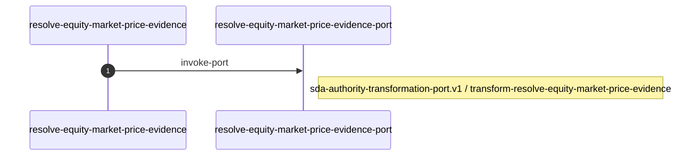
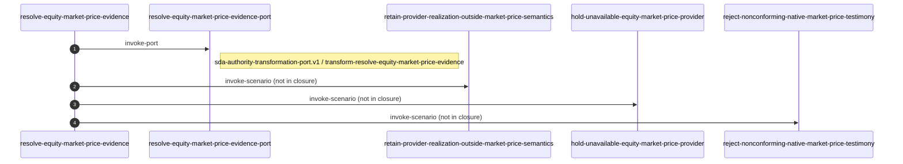
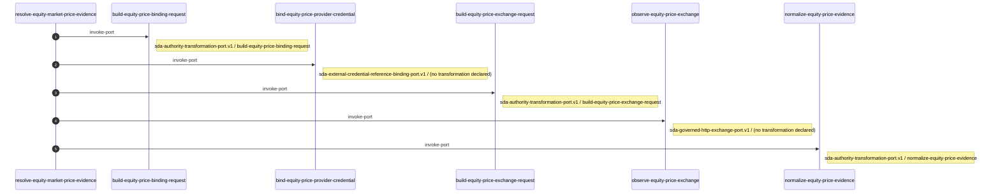

# resolve-equity-market-price-evidence

## Identity

| Field | Value |
| --- | --- |
| Capability | resolve-equity-market-price-evidence |
| Namespace | sidefx:capabilities |
| Mode | _(not declared)_ |
| Declared root scenario | resolve-equity-market-price-evidence |
| Definition digest | `sha256:832f4f3ad1f10951ed3e925107fb8bf6d7712fba55f8a9376f5fe24d54905e10` |
| Snapshot | `sha256:1a770ac0795d10665a88166f8d8c968dc5b2d030fdfab2b837aa6071d135f9e9` |
| Projection | `sha256:8aae1f306ced5952333da0fb936d2f846081f8ed31b6f627a2099ad49cbbfdb0` |

## Review summary (10 observations)

Each line states what the selected model declares. None is a judgement about
whether the estate is correct - that is the reviewer's to make.

**Structure — the declared circuit does not join up here (3)**

| Subject | Observation | Code |
| --- | --- | --- |
| `resolve-equity-market-price-evidence.v1 -> hold-unavailable-equity-market-price-provider` | The authority declares an invocation of this scenario, but the model does not resolve it into the closure. Both are retained authority and they disagree. Declared by 3 of its 6 retained definitions. | `SCENARIO_INVOCATION_UNRESOLVED` |
| `resolve-equity-market-price-evidence.v1 -> reject-nonconforming-native-market-price-testimony` | The authority declares an invocation of this scenario, but the model does not resolve it into the closure. Both are retained authority and they disagree. Declared by 3 of its 6 retained definitions. | `SCENARIO_INVOCATION_UNRESOLVED` |
| `resolve-equity-market-price-evidence.v1 -> retain-provider-realization-outside-market-price-semantics` | The authority declares an invocation of this scenario, but the model does not resolve it into the closure. Both are retained authority and they disagree. Declared by 3 of its 6 retained definitions. | `SCENARIO_INVOCATION_UNRESOLVED` |

**Divergence — one declared id, definitions that disagree (3)**

| Subject | Observation | Code |
| --- | --- | --- |
| `resolve-equity-market-price-evidence.v1` | 6 retained definitions declaring 3 different operation sets. The circuit draws their union; no single definition declares all of it. | `EXECUTION_AUTHORITY_DEFINITIONS_DISAGREE` |
| `resolve-equity-market-price-evidence-port` | 5 retained definitions with differing digests that declare the same thing. | `PORT_DEFINITIONS_REPEATED` |
| `transform-resolve-equity-market-price-evidence` | 5 retained definitions with differing digests that declare the same thing. | `TRANSFORMATION_DEFINITIONS_REPEATED` |

**Meaning — the authority declares none here (4)**

| Subject | Observation | Code |
| --- | --- | --- |
| `resolve-equity-market-price-evidence` | The capability declares no experience, so it states no promise. | `EXPERIENCE_ABSENT` |
| `resolve-equity-market-price-evidence` | No observable condition is declared against this capability definition, so nothing states how its promise is observed. | `OBSERVABLE_CONDITIONS_ABSENT` |
| `resolve-equity-market-price-evidence` | Every retained definition declares the scenario's face only. No definition declares an authored specification, so the scenario states no behaviour in language. | `SCENARIO_SPECIFICATION_ABSENT` |
| `resolve-equity-market-price-evidence` | The capability declares no user story, so it states no actor, intent or outcome. | `USER_STORY_ABSENT` |

## Capability circuit today

The circuit the estate declares now, drawn in the same shape a blueprint is drawn in,
so the two can be read against each other. Node shape is the declared kind, the label lines
are the declared face, and each edge caption is the declared operation kind and its step in
the declared order. A node in red is a point the review summary names.

```mermaid
flowchart TD
  resolve-equity-market-price-evidence["resolve-equity-market-price-evidence<br/>responsibility / CAPABILITY<br/>I: live-equity-price-request<br/>E: equity-market-price-evidence-requested<br/>O: equity-market-price-evidence"]
  resolve-equity-market-price-evidence-port[["resolve-equity-market-price-evidence-port<br/>provider-slot / PROVIDER<br/>P: resolve-equity-market-price-evidence-port / sda-authority-transformation-port.v1"]]
  retain-provider-realization-outside-market-price-semantics["retain-provider-realization-outside-market-price-semantics<br/>responsibility / CAPABILITY<br/>(declared, not resolved into the closure)"]
  hold-unavailable-equity-market-price-provider["hold-unavailable-equity-market-price-provider<br/>responsibility / CAPABILITY<br/>(declared, not resolved into the closure)"]
  reject-nonconforming-native-market-price-testimony["reject-nonconforming-native-market-price-testimony<br/>responsibility / CAPABILITY<br/>(declared, not resolved into the closure)"]
  build-equity-price-binding-request[["build-equity-price-binding-request<br/>provider-slot / PROVIDER<br/>P: build-equity-price-binding-request / sda-authority-transformation-port.v1"]]
  bind-equity-price-provider-credential[["bind-equity-price-provider-credential<br/>provider-slot / PROVIDER<br/>P: bind-equity-price-provider-credential / sda-external-credential-reference-binding-port.v1"]]
  build-equity-price-exchange-request[["build-equity-price-exchange-request<br/>provider-slot / PROVIDER<br/>P: build-equity-price-exchange-request / sda-authority-transformation-port.v1"]]
  observe-equity-price-exchange[["observe-equity-price-exchange<br/>provider-slot / PROVIDER<br/>P: observe-equity-price-exchange / sda-governed-http-exchange-port.v1"]]
  normalize-equity-price-evidence[["normalize-equity-price-evidence<br/>provider-slot / PROVIDER<br/>P: normalize-equity-price-evidence / sda-authority-transformation-port.v1"]]
  resolve-equity-market-price-evidence -->|"5 of 6 definitions / invoke-port / step 1"| resolve-equity-market-price-evidence-port
  resolve-equity-market-price-evidence -->|"3 of 6 definitions / invoke-scenario / step 2"| retain-provider-realization-outside-market-price-semantics
  resolve-equity-market-price-evidence -->|"3 of 6 definitions / invoke-scenario / step 3"| hold-unavailable-equity-market-price-provider
  resolve-equity-market-price-evidence -->|"3 of 6 definitions / invoke-scenario / step 4"| reject-nonconforming-native-market-price-testimony
  resolve-equity-market-price-evidence -->|"1 of 6 definitions / invoke-port / step 1"| build-equity-price-binding-request
  resolve-equity-market-price-evidence -->|"1 of 6 definitions / invoke-port / step 2"| bind-equity-price-provider-credential
  resolve-equity-market-price-evidence -->|"1 of 6 definitions / invoke-port / step 3"| build-equity-price-exchange-request
  resolve-equity-market-price-evidence -->|"1 of 6 definitions / invoke-port / step 4"| observe-equity-price-exchange
  resolve-equity-market-price-evidence -->|"1 of 6 definitions / invoke-port / step 5"| normalize-equity-price-evidence
  classDef scenario fill:#C2E5FF,stroke:#3DADFF
  classDef success fill:#CDF4D3,stroke:#66D575
  classDef failure fill:#FFE0C2,stroke:#FF9E42
  classDef rejection fill:#FFCDC2,stroke:#FF7556
  classDef provider fill:#DCCCFF,stroke:#874FFF
  classDef terminal fill:#E8E8E8,stroke:#8A8A8A
  class resolve-equity-market-price-evidence scenario
  class resolve-equity-market-price-evidence-port,build-equity-price-binding-request,bind-equity-price-provider-credential,build-equity-price-exchange-request,observe-equity-price-exchange,normalize-equity-price-evidence provider
  class retain-provider-realization-outside-market-price-semantics,hold-unavailable-equity-market-price-provider,reject-nonconforming-native-market-price-testimony rejection
```



## Blueprint candidate (0)

The estate retains no circuit blueprint candidate bound to this capability,
so there is nothing to compare today's circuit against.

## Execution order

The declared operation sequence for `resolve-equity-market-price-evidence`, in the order the
execution authority declares it.

Its definitions declare **3 different sequences**. Each is drawn as declared;
no single one of them is the capability's order.

**`resolve-equity-market-price-evidence.v1` — 2 of 6 definitions** (`0e7f4b725405`, `70fa546146ee`)



**`resolve-equity-market-price-evidence.v1` — 3 of 6 definitions** (`2cb941d9edf7`, `6e5bc286dc00`, `c54a498a1552`)



**`resolve-equity-market-price-evidence.v1` — 1 of 6 definitions** (`e5b72563bd0e`)



## User story

The estate declares no user story for this capability. _(not declared)_

## Experience

The estate declares no experience for this capability. _(not declared)_

## Observable conditions (0)

No observable condition is declared against this capability definition. _(not declared)_

## Scenario closure (1)

The model declares 0 scenario invocations as relationships between these scenarios.

## Scenarios

### resolve-equity-market-price-evidence

| Field | Value |
| --- | --- |
| Scenario | `resolve-equity-market-price-evidence` |
| Depth | 0 (the scenario read) |
| Retained definitions | 1 |

This definition declares the scenario's face rather than an authored specification.

| Face | Declared |
| --- | --- |
| Event | equity-market-price-evidence-requested |
| Input | live-equity-price-request |
| Outcome | equity-market-price-evidence |

## Execution plan (1 declared execution authority)

### `resolve-equity-market-price-evidence.v1`

| Field | Value |
| --- | --- |
| Owning scenario | resolve-equity-market-price-evidence |
| Retained definitions | 6 |
| Agreement | **they declare 3 different operation sets** |

```text
resolve-equity-market-price-evidence.v1   (definition 0e7f4b725405)
`-- 1. invoke-port --> resolve-equity-market-price-evidence-port
    |-- platform capability: sda-authority-transformation-port.v1
    `-- transformation: transform-resolve-equity-market-price-evidence
```

```text
resolve-equity-market-price-evidence.v1   (definition 2cb941d9edf7)
|-- 1. invoke-port --> resolve-equity-market-price-evidence-port
|   |-- platform capability: sda-authority-transformation-port.v1
|   `-- transformation: transform-resolve-equity-market-price-evidence
|-- 2. invoke-scenario --> retain-provider-realization-outside-market-price-semantics   (not in the declared closure)
|-- 3. invoke-scenario --> hold-unavailable-equity-market-price-provider   (not in the declared closure)
`-- 4. invoke-scenario --> reject-nonconforming-native-market-price-testimony   (not in the declared closure)
```

```text
resolve-equity-market-price-evidence.v1   (definition 6e5bc286dc00)
|-- 1. invoke-port --> resolve-equity-market-price-evidence-port
|   |-- platform capability: sda-authority-transformation-port.v1
|   `-- transformation: transform-resolve-equity-market-price-evidence
|-- 2. invoke-scenario --> retain-provider-realization-outside-market-price-semantics   (not in the declared closure)
|-- 3. invoke-scenario --> hold-unavailable-equity-market-price-provider   (not in the declared closure)
`-- 4. invoke-scenario --> reject-nonconforming-native-market-price-testimony   (not in the declared closure)
```

```text
resolve-equity-market-price-evidence.v1   (definition 70fa546146ee)
`-- 1. invoke-port --> resolve-equity-market-price-evidence-port
    |-- platform capability: sda-authority-transformation-port.v1
    `-- transformation: transform-resolve-equity-market-price-evidence
```

```text
resolve-equity-market-price-evidence.v1   (definition c54a498a1552)
|-- 1. invoke-port --> resolve-equity-market-price-evidence-port
|   |-- platform capability: sda-authority-transformation-port.v1
|   `-- transformation: transform-resolve-equity-market-price-evidence
|-- 2. invoke-scenario --> retain-provider-realization-outside-market-price-semantics   (not in the declared closure)
|-- 3. invoke-scenario --> hold-unavailable-equity-market-price-provider   (not in the declared closure)
`-- 4. invoke-scenario --> reject-nonconforming-native-market-price-testimony   (not in the declared closure)
```

```text
resolve-equity-market-price-evidence.v1   (definition e5b72563bd0e)
|-- 1. invoke-port --> build-equity-price-binding-request
|   |-- platform capability: sda-authority-transformation-port.v1
|   `-- transformation: build-equity-price-binding-request
|-- 2. invoke-port --> bind-equity-price-provider-credential
|   |-- platform capability: sda-external-credential-reference-binding-port.v1
|   `-- transformation: (not declared)
|-- 3. invoke-port --> build-equity-price-exchange-request
|   |-- platform capability: sda-authority-transformation-port.v1
|   `-- transformation: build-equity-price-exchange-request
|-- 4. invoke-port --> observe-equity-price-exchange
|   |-- platform capability: sda-governed-http-exchange-port.v1
|   `-- transformation: (not declared)
`-- 5. invoke-port --> normalize-equity-price-evidence
    |-- platform capability: sda-authority-transformation-port.v1
    `-- transformation: normalize-equity-price-evidence
```

## Declared scenario invocations not in the closure (3)

An execution authority declares an invocation of these scenarios, but the selected
estate model does not resolve them into this capability's closure. Both statements are
retained authority; they disagree.

- `hold-unavailable-equity-market-price-provider`
- `reject-nonconforming-native-market-price-testimony`
- `retain-provider-realization-outside-market-price-semantics`

## Transformations (4)

| Transformation | Retained definitions | Declared expression keys |
| --- | --- | --- |
| `build-equity-price-binding-request` | 1 | fields, op |
| `build-equity-price-exchange-request` | 1 | fields, op |
| `normalize-equity-price-evidence` | 1 | bindings, op, value |
| `transform-resolve-equity-market-price-evidence` | 5 | bindings, op, value |

## Mechanics (18)

5 providers declare an implementation of these ports' platform capabilities.

| Provider | Mechanic | Definition profile | Via platform capability |
| --- | --- | --- | --- |
| `ScenarioKernel.Adapters.Consumer.SemanticTransformationEngine` | `authority-driven-transformation` | sda-platform-provided-mechanic.v1 | `sda-authority-transformation-port.v1` |
| `ScenarioKernel.Adapters.Consumer.SemanticTransformationEngine` | `event-port-invocation` | sda-platform-provided-mechanic.v1 | `sda-authority-transformation-port.v1` |
| `ScenarioKernel.Adapters.Consumer.SemanticTransformationEngine` | `state-projection` | sda-platform-provided-mechanic.v1 | `sda-authority-transformation-port.v1` |
| `ScenarioKernel.Adapters.Consumer.SemanticTransformationEngine` | `transition-binding-projection` | sda-platform-provided-mechanic.v1 | `sda-authority-transformation-port.v1` |
| `ScenarioKernel.NodePlatform.Execution.AuthorityTransformation` | `authority-driven-transformation` | sda-platform-provided-mechanic.v1 | `sda-authority-transformation-port.v1` |
| `ScenarioKernel.NodePlatform.Execution.AuthorityTransformation` | `event-port-invocation` | sda-platform-provided-mechanic.v1 | `sda-authority-transformation-port.v1` |
| `scenario_kernel.adapters.SemanticTransformationEngine` | `authority-driven-transformation` | sda-platform-provided-mechanic.v1 | `sda-authority-transformation-port.v1` |
| `scenario_kernel.adapters.SemanticTransformationEngine` | `event-port-invocation` | sda-platform-provided-mechanic.v1 | `sda-authority-transformation-port.v1` |
| `scenario_kernel.adapters.SemanticTransformationEngine` | `state-projection` | sda-platform-provided-mechanic.v1 | `sda-authority-transformation-port.v1` |
| `scenario_kernel.adapters.SemanticTransformationEngine` | `transition-binding-projection` | sda-platform-provided-mechanic.v1 | `sda-authority-transformation-port.v1` |
| `ScenarioKernel.NodePlatform.Effects.ExternalCredentialReferenceBinding` | `event-port-invocation` | sda-platform-provided-mechanic.v1 | `sda-external-credential-reference-binding-port.v1` |
| `ScenarioKernel.NodePlatform.Effects.ExternalCredentialReferenceBinding` | `external-credential-reference-binding` | sda-platform-provided-mechanic.v1 | `sda-external-credential-reference-binding-port.v1` |
| `ScenarioKernel.NodePlatform.Effects.ExternalCredentialReferenceBinding` | `one-use-opaque-credential-handle` | sda-platform-provided-mechanic.v1 | `sda-external-credential-reference-binding-port.v1` |
| `ScenarioKernel.NodePlatform.Effects.ExternalCredentialReferenceBinding` | `secret-non-disclosure` | sda-platform-provided-mechanic.v1 | `sda-external-credential-reference-binding-port.v1` |
| `ScenarioKernel.NodePlatform.Effects.GovernedHttpExchange` | `bounded-response-observation` | sda-platform-provided-mechanic.v1 | `sda-governed-http-exchange-port.v1` |
| `ScenarioKernel.NodePlatform.Effects.GovernedHttpExchange` | `credential-injection-without-disclosure` | sda-platform-provided-mechanic.v1 | `sda-governed-http-exchange-port.v1` |
| `ScenarioKernel.NodePlatform.Effects.GovernedHttpExchange` | `event-port-invocation` | sda-platform-provided-mechanic.v1 | `sda-governed-http-exchange-port.v1` |
| `ScenarioKernel.NodePlatform.Effects.GovernedHttpExchange` | `single-governed-http-exchange` | sda-platform-provided-mechanic.v1 | `sda-governed-http-exchange-port.v1` |

---

Read from snapshot `sha256:1a770ac0795d10665a88166f8d8c968dc5b2d030fdfab2b837aa6071d135f9e9`, projection `sha256:8aae1f306ced5952333da0fb936d2f846081f8ed31b6f627a2099ad49cbbfdb0`.
Every value above is retained estate authority; nothing is inferred or supplied by the renderer.
