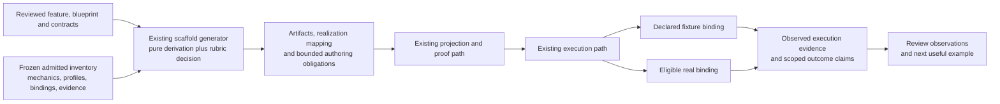

# Scaffold-generation operationalization: implementation plan

Status: revised for team review · 2026-09-11  
Scope: extend `generate-executable-capability-scaffold` and its existing execution integration. This document specifies future work; it does not report that work as implemented or admitted.

The generator should return the smallest executable realization of a declared Input → Event → Outcome path, with an explicit account of admitted mechanics reused, simulated boundaries, unresolved obligations and evidence needed for the promised outcome. The [architecture decision rubric](sidefx-architecture-decision-rubric.md) governs how the team evaluates that choice and subsequent additions.

This revision responds to the [plan review](scaffold-generation-operationalization-plan-review.md). Its disposition was **revise the rubric operationalization**: the scaffold mechanics were developed in detail while the scoring had not received the same concrete treatment. Four revisions were accepted and are carried here:

1. A scored decision register appears near the beginning, with supporting detail in section 11.
2. Scoring fields, attribution and rubric version are specified in section 4.3.
3. The same assessments are required in generated JSON and human-facing output.
4. Acceptance evidence verifies that scores, reasons, unknowns and later observations survive the complete delivery path.

The review's further directions are integrated as explicit sections: the intended flywheel and its distinction from generator reuse (section 2), the governed read of what already exists (section 3.1), SQL as the default authoring and review surface (section 5), reconciliation as the operating discipline (section 6), the caller-facing invocation interface (section 7), and the mutable-workshop boundary for database experimentation (section 1.1).

A second review round accepted four corrections now carried throughout: the immutability and candidate-successor rule is scoped to **sealed capsule artifacts only**, not the database working representation (section 1.1, section 5); the workshop has an executable deliverable (Increment 1) proving that an edited, uncapsulized definition runs through the CLI before capsulization; the compact score display (section 2.3) is derived from the single assessment per decision (section 11); and burden evidence `1` is claimed only with a named inspected source or supported estimate, with unsupported cells marked `unassessed`.

The first workshop handoffs, [sql-cli-work-order-001.md](sql-cli-work-order-001.md) and [sql-cli-work-order-002.md](sql-cli-work-order-002.md), are attached to Increment 1 and selected by the least-work-complete-loop rule in section 2.4, which treats review and maintenance effort as part of the architectural cost. Their evidence is currently untested; completion requires observed CLI results.

Generation remains a pure derivation. The existing capability execution path runs the resulting realization. This preserves the generator's declared responsibility while making its output useful sooner: first a truthful executable result, then a verified outcome with real providers wherever required.

## 1. Review scope and authority

The builder requested this implementation plan and the solidification of the rubric. The supplied proposal establishes the direction: minimum executable functionality, reuse before new mechanics, explicit simulation, provider contracts and mappings, and measured improvement across successive capabilities. This plan makes that direction concrete for team review.

The rubric's scores, the field names below and the proposed capability revisions remain proposals. They do not override admitted requirements, select a new topology, or confer permission to execute effects. No implementation, registration, managed admission, provider call or database mutation is part of preparing this document.

There are two distinct products to track during implementation:

| Product | Applicable change path |
| --- | --- |
| Revision of the existing managed scaffold generator | Resolve its exact predecessor and current contracts; follow the Harness managed revision lifecycle. Changing its declared behavior is managed work. |
| Capability produced by the revised generator | Determine whether the request is token provisioning or managed admission/revision. Keep the cheap provisioning path available; do not impose managed publication on every generated token. |

Harness lifecycle and authorship requirements come from its [AGENTS.md](../../agentic-harness/AGENTS.md), [CLAUDE.md](../../agentic-harness/CLAUDE.md) and [capability-change lifecycle](../../agentic-harness/docs/capability-change-lifecycle.md). Author declarative meaning there and project executable code through the applicable admitted mechanisms. Database registration is a separate projection/publication boundary; SQL `PUBLISHED` is not Harness managed admission.

### 1.1 Mutable workshop, managed promotion

The review corrected a framing error carried by the earlier draft: the repository's current write restrictions were described as requirements for the intended database playground, when those restrictions themselves need to be assessed against that purpose. The boundary adopted for this work is:

| Boundary | Intended behavior |
| --- | --- |
| Database experimentation | Freely insert, update, delete, reshape and retry. Incomplete work is allowed. |
| Execution and inspection | Exercise the current definitions, vary inputs, inspect results and reconcile discrepancies through SQL and CLI. |
| Promotion into a managed capsule | Apply the required conformance, closure and admission checks; seal the resulting artifact. |
| Sealed capsule | Preserve its governed identity and immutable contents. |

Deterministic experimentation does not require immutable working data. The definition can change repeatedly while each execution remains understandable: what input was supplied, what definition ran and what outcome occurred. That does not require a managed revision ceremony for every edit. Likewise, projecting a capsule into the database gives material to experiment with; editing that working representation does not rewrite the sealed source capsule.

This changes how the existing implementation is reviewed. The append-only guards, publication-dependent write restrictions and mandatory lineage machinery must each justify their presence **inside the playground**. Useful lineage can remain available as information; it should not automatically become a prerequisite for trying a change. The rubric applies directly: what does a restriction contribute to the current experiment, and what delay or maintenance burden does it impose? Requirements that belong to promotion are evaluated at promotion. The boundary carried forward is: **the database is a mutable workshop for building and exercising deterministic capabilities; managed governance becomes binding when promoting and sealing them.**

The immutability rule and its candidate-successor requirement apply specifically to **sealed capsule artifacts**, not to the database working representation. Editing a working definition through SQL is an ordinary update: it does not require creating a governed successor, a new semantic identity, or managed lineage for each experiment. Only when a working definition is promoted into a sealed capsule do the conformance, closure and admission checks of that boundary apply. CRUD authority depends on the kind of data being managed: sealed artifacts preserve governed identity and immutable contents; working data is freely mutable.

## 2. Intended flywheel and the scored decision register

A decision record that displays scores without naming what they assess repeats the gap the review identified. This section states the loop first; section 4.3 defines the scoring fields; section 11 records the scores against the named steps.

### 2.1 What flywheel are we advancing?

This plan advances two connected but distinct loops, and must not conflate them:

- **The feature's outcome flywheel** — delivering the particular Input → Event → Outcome experience its user needs and revealing the next valuable scenario or friction.
- **The generator's reuse flywheel** — retaining qualified contracts, mechanics, bindings and evidence so the next relevant capability costs less.

A feature can reuse many mechanics yet still fail to create the experience its user needs. Reuse is a means; the feature's intended outcome is the end. The two loops are assessed separately and reported together.

The intended loop this plan serves:

1. **Start with a real need** and the smallest executable Input → Event → Outcome.
2. **Resolve existing mechanics** and author only what is missing to establish the useful outcome.
3. **Retain qualified, reusable contracts, mechanics, bindings and evidence** from that delivery.
4. **Use those assets in the next relevant capability**, reducing repeated work and uncertainty.
5. **Deliver subsequent useful outcomes with less effort**, generating further reusable assets and evidence.

**The loop closes when something retained from one delivery measurably improves a subsequent delivery.** More capsules or mechanics alone do not demonstrate that improvement.

### 2.2 Assess every material decision against those steps

| Assessment | Question |
| --- | --- |
| **Contribution** | Which named flywheel step does this decision enable or improve? |
| **Positive effects** | Does it accelerate useful execution, improve reliability, or reduce repeated work? |
| **Negative effects** | Does it add authoring overhead, maintenance, dependencies, or delay? Who bears that burden? |
| **Evidence** | Is the claimed effect hypothesized, supported by inspection, or observed in execution? |
| **Disposition** | Is it necessary now, proportionate to the expected benefit, or better deferred? |

### 2.3 Provisional scored register

A compact excerpt of the single assessment in section 11.1. There is exactly one assessment per decision; this view is derived from it and must never be maintained separately. `Not yet scored` does not appear as a second value: each decision carries an evidence classification, and evidence `0` means an untested hypothesis.

| Decision (record ID) | Contribution | Benefit evidence | Burden evidence | Reason |
| --- | ---: | ---: | ---: | --- |
| Complete the pilot's required schema references (D5) | **3** | **0** | **1** | Necessary for the declared contract-validation step to execute; benefit is an untested hypothesis, while the source/validation burden is supported by inspected schema-emission defects. |
| Resolve admitted mechanics before authoring new ones (D2, D4) | **2** | **0** | **1** | Directly supports mechanic selection; reduced delivery effort is an untested hypothesis, while provenance/qualification burden is supported by inspected reuse rules and resolver code. |
| Build a separate rubric service or universal optimizer (D8) | **1** | **0** | **unassessed** | Possible future contribution; no present dependency established and no inspected source supports a burden estimate. |

Two distinctions the record must preserve:

- **An incomplete assessment is not the same as evidence score 0.** This register currently classifies the benefit claims above as `0` (untested hypothesis); where an assessment is genuinely incomplete it is recorded once as `unassessed` in section 11 and inherited here unchanged.
- **Benefit and burden need separate evidence scores when their support differs.** First-delivery time, repetition savings, continuing burden, reversibility and distribution remain separate measures. They are never collapsed into an invented aggregate score.

### 2.4 Selection rule: the least-work complete loop

When more than one path can advance the named flywheel step, choose **the least-work option that proves the complete intended loop**. Component-only or partial proof does not close the loop; necessary supporting work counts as partial progress until the loop works end to end. **Review effort is itself part of the architectural cost**, so a path that is cheaper to implement but harder to inspect, review or maintain is not automatically the lower-work option. Working data stays mutable and capsule promotion owns managed governance, so proving the loop never requires managed-promotion prerequisites.

This rule selects among candidate work orders for the first workshop deliverable (section 8, Increment 1). The current candidates are:

| Work order | Loop it proves | Checks |
| --- | --- | --- |
| [sql-cli-work-order-001.md](sql-cli-work-order-001.md) | SQL generates a Hello World scaffold → CLI invokes it → SQL changes the message → repeat with an unchanged CLI/runtime. | Read back the scaffold; actual stdout; SQL-only message change and restore; a second identity from the same operation. |
| [sql-cli-work-order-002.md](sql-cli-work-order-002.md) | Read existing working data → edit a definition through SQL → invoke through CLI → vary inputs → reconcile → roll back. | Actual read; edited-definition execution; input variation (two symbols and one invalid input); rollback confirmed by a fresh read. |

The two are not additive requirements. The least-work path that closes the complete loop is selected first; the other remains partial progress until its own loop closes. Both keep working data mutable, require observed CLI results before claiming completion, and treat review and maintenance effort as part of the cost. The scorecards in each work order are provisional and reconcile against section 11.

## 3. Inspected baseline, governed read and concrete gaps

Local inspection on 2026-09-11 covered the generator feature and capsule entry inventory in `agentic-harness`, relevant database model/registration source, and the execution, validation and documentation paths in `sfx-embody` at commit `9ac315c`. It did not invoke the generator, verify managed-estate admission, query the live database or run providers. Historical run reports below are evidence of their recorded runs, not claims about today's selected generation.

| Existing responsibility | Evidence inspected | Implementation implication |
| --- | --- | --- |
| Pure generation of a standard shell, slots, evidence obligations and bounded authoring work | [Generator feature](../../agentic-harness/features/generate-executable-capability-scaffold.feature) | Extend this capability; retain supplied inventory, no external effects during generation and byte-identical replay. |
| Blueprint conditioning, candidate/admitted distinction and exact embodiment | Same feature: `condition-scaffold-on-admitted-blueprint`, `prove-blueprint-embodiment` | Preserve cells, edges, terminals, precedence, altitudes and required slots. A first realization is a binding of that design, not a replacement circuit. |
| Slot lookup and completeness | Same feature: `resolve-slots-against-admitted-estate`, `resolve-scaffold-completeness-level` | `FOUND`/`NOT_FOUND` and design completeness are insufficient to express compatibility, actual execution or verified outcomes. Add separate evidence without reinterpreting those statuses. |
| Unresolved root meaning and preserving child cells | Same feature: `preserve-semantic-transformation-as-unresolved` | The rule currently rejects a resolved root as `SEMANTIC_MEANING_FABRICATED`. Reusing a supplied admitted transformation needs an explicit feature/authority revision, not a workaround in generated code. |
| Direct database invocation and Node embodiment | [Invocation](../src/invoke-database-capability.mjs), [authority reader](../src/read-authority.mjs), [materializer](../src/materialize-node.mjs), [memory loader](../src/load-memory-scenario.mjs) | Reuse the read → plan → link → execute route. `prepare` is a separate optional proof, not an invocation prerequisite. Current delivery calls its provider `CANDIDATE_PHYSICAL_PROVIDER`; preserve that qualification. |
| Real contract projection and full catalog closure | `materialize-node.mjs` resolves required schemas and catalog `$ref` sources | Supply exact contract bytes/references. A filename or open placeholder is insufficient proof of executable contract closure. |
| Scaffold fixture execution through effect stubs | [Validator](../scripts/validate-scaffold.mjs), [equity fixtures](../scaffolds/resolve-equity-market-price-evidence/fixtures.authority.json) | There is a useful seam precedent. The validator reads the selected capability, overlays matching retained sources, and reports disk-only files without adding them. It is not yet a general proof of an entirely new capsule. |
| Versioned mechanics, providers, profiles and bindings in SQL | [Database catalog](../../../sidefx-database/src/migration/catalog.mjs) | Extend exact retrieval/projection only where data is missing; avoid a parallel mechanic catalog. Existing tables alone do not establish complete semantic coverage. |
| Schema emission and source-reproducibility defects | [Scaffold invocation report](scaffold-invocation-rapidapi.md), [schema derivation proposal](deriving-contract-schemas.md) | Recheck the catalog-without-schemas and aliased-filename defects. Repair through source bytes and the supported pipeline; do not repeat one-off row repairs. |
| Feature/version ownership remains migration work | [Canonical-feature plan](canonical-feature-migration-gap.md), [equity review](reviews/resolve-equity-market-price-evidence.md) | Pin the exact feature, selected capability revision and source set. Historical execution definitions must not be unioned into a fictitious current circuit. |

The schema derivation document remains a separate proposal: inferred schemas can assist authoring and comparison, but are not automatically admitted contracts. The generator's feature promises contract skeletons; the historical run report records that schemas were missing. Treat this discrepancy as a regression to reproduce, not as permission to weaken validation.

The source proposal referred to an execution-plan v3 artifact not supplied here. Local capsule inspection found `runtime.execution-plan.node.v2.json`. Resolve the actual supported execution-plan contract at implementation time; this plan does not assume a v3 migration.

### 3.1 The first step is a governed read of what exists

The first concrete step is not a change. It is a governed read that gives subsequent scaffolding and migration a verifiable starting point: read the scaffold generator's selected definition and its **Input → Event → Outcome** records, preserving missing fields visibly.

The repository already carries useful machinery for this. The existing restricted query runner pins the selected model, restricts access, rolls back its transaction, reports query/input/result digests and truncation, and is source-grounded in the actual schema. A read-only query in that runner is prepared as `select-scaffold-foundation.sql` in the review workspace; it has **not** been executed here because no live database connection is available. It is the first observation, not a result.

The immediate checkpoint is small: **run the read, inspect the actual records, reconcile their identities and missing references, then choose the first necessary change.** That exercises the data-governance foundation before expanding the CRUD surface. Section 8 Increment 0 owns this step.

The provider split this read must expose remains the foundation for later work:

| Responsibility | What it establishes |
| --- | --- |
| Capability contract | Which data operation is requested, its scope, expected result and failure behavior. |
| Declared mechanics | Selection, validation, transformation and required consistency guarantees. |
| SQL Server provider | Parameterized T-SQL and SQL Server's physical execution behavior. |
| PostgreSQL provider | PostgreSQL statements and physical behavior satisfying the same contract. |
| Evidence | What was read or changed, against which source/version, with what result. |

Dynamic statements follow the same model: declared fields, predicates, parameters and permitted targets determine the provider's statement. Some provider differences affect meaning, including ordering, type conversion and transaction behavior. A provider must demonstrate the required guarantees or report that it cannot satisfy them; migration then checks preservation of declared data and behavior.

## 4. Target behavior

Given a reviewed feature, its applicable topology/blueprint, exact contract and mechanic references, a frozen admitted inventory and explicit realization inputs, the revised generator produces:

1. The existing shell, blueprint binding/embodiment receipt, artifacts, completeness and authoring queue.
2. A minimum-realization decision recording the selected path, necessity, reuse basis, costs/unknowns and deferred obligations under the rubric, with the scored fields of section 4.3.
3. A mapping for every required responsibility and slot: executable using an eligible binding, simulated at a declared seam, or unresolved. Unselected declared branches remain visible and receive coverage dispositions.
4. Resolvable contract artifacts/references, explicit semantic transformations or admitted transformation references, and fixture declarations sufficient for the selected executable path. Missing meaning remains an authoring obligation.
5. Proof obligations for input/output admission, behavior, simulation attribution, provider conformance and any promised external result.

The execution consumer subsequently validates and runs the exact artifact, retaining observations about what actually happened. Generated expected evidence is never presented as observed evidence.



This diagram describes the delivery process, not new topology inside any generated capability. The fixture and real bindings occupy the same declared seam. Registration or managed publication occurs through the applicable existing path when requested; neither is silently performed by generation.

### 4.1 Minimum executable responsibilities

| Position | First executable realization | Verification |
| --- | --- | --- |
| Input | Accept the declared data and invoke the applicable contract validator | Valid input admitted; invalid input reaches the declared failure before downstream effects. |
| Event | Execute explicit supplied semantics or reference admitted semantics; bind real eligible mechanics and explicit fixtures at remaining permitted seams | Operations retain their responsibility and order; no invented transformation, pass-through substitution or undeclared effect. |
| Outcome | Produce and validate the declared output; preserve terminal failures and holds | Schema validity plus scenario-specific assertions; simulated output identified as simulated. |
| Evidence | Retain exact source/binding identities and per-operation execution observations | Distinguish expected from observed, real from simulated, and structural proof from fulfillment of the outcome. |

For a declared read → hash → model interpretation path, reuse compatible admitted read and hash mechanics and place the fixture at the model boundary. That example is conditional on those mechanics and that seam being authorized; it does not instruct the generator to invent this circuit or imply the current estate contains every binding. A provider-free path needs no artificial provider slot. A multi-provider path retains every required provider and dependency.

### 4.2 Resolution procedure inside the existing capability

1. Validate required carrier/inventory presence, exact identities and applicable provenance through the existing authority boundary. Caller-supplied data does not become admitted merely by declaring itself admitted. Missing inventory is distinct from a supplied empty inventory. Validate contract shapes before lookup; bare strings must not silently behave like objects with missing IDs.
2. Condition on the blueprint where supplied, record candidate versus admitted status and reject contradictory loose fields. Derive obligations only from the resulting declared design.
3. For each obligation, resolve admitted precedents, contracts, effects, failure behavior, execution constraints, profiles, provider eligibility and applicable sharing scope. Record why each considered alternative does or does not close it.
4. Apply `REUSE_EXISTING` → `COMPOSE_EXISTING` → `AUTHOR_PROFILE` → `AUTHOR_NEW`. Use existing authoring-disposition/context responsibilities where their current contracts apply. Resolve equivalent alternatives using the declared selection policy; absent such a policy, retain the ambiguity. Insufficient justification or ambiguity yields `HELD`; a candidate is not admitted by ranking highly.
5. Choose the first realization within the declared topology: real eligible mechanics where available; explicitly requested fixture isolation or declared simulation at unresolved seams; otherwise an open obligation. No automatic fallback from a failed real provider to simulated success.
6. Emit the rubric decision, artifact/reference closure, realization mapping, proof obligations and the next bounded authoring queue. Preserve target requirements when a fixture enables early execution.
7. Replay generation from identical canonical inputs and frozen evidence. Keep timestamps, execution IDs and evolving measurements outside the deterministic generation digest basis. Rule changes change the generator identity and therefore the replay basis.

The [Semantic Brain](../../agentic-harness/docs/SideFX%20Semantic%20Brain.md) records this reuse ordering. Parameters reuse an existing contract; allowed specialization uses a profile; a conforming implementation changes binding; different behavior/effects/guarantees require revised or new semantic identity. This procedure must not let the generator author domain meaning or rewire composition to save effort.

### 4.3 Contract and evidence changes

The names below describe proposed information groups, not newly admitted schema IDs. First map them to existing carrier, execution-plan and receipt structures; add versioned fields only for proven gaps. Missing estimates or scores do not block otherwise authorized work, but the fields themselves remain present and are displayed; a missing value is recorded as **unknown** or **unassessed**, never silently omitted and never silently treated as zero.

| Information group | Minimum contents | Owner |
| --- | --- | --- |
| Frozen basis | Feature/capability/scenario versions; blueprint digest/status; inventory and mechanic-catalog identities; generator/rule version; **rubric version**; contract and supporting evidence digests; target/environment | Generation request and existing provenance structures. |
| Rubric decision | Scope/observable outcome and the named flywheel step; smallest sufficient realization; each material commitment with its source and status; omission consequence; **contribution score 0–3 with its reason**; **positive and negative effects, each with its own evidence score 0–2, sources and rationale**; first-delivery effect; repetition effect; continuing burden; reversibility; distribution of effects; necessity; disposition/revisit trigger; subsequent observations; unknowns explicit | Generated decision record plus attributed builder/reviewer inputs. |
| Reuse resolution | Required mechanic identity/version; precedent/disposition; parameter/profile/composition/binding references; compatibility and permission evidence; rejected candidates and reasons | Existing slot resolution extended with evidence. |
| Realization mapping | Declared scenario/operation/slot reference; intended mechanic; chosen real or fixture binding or open status; reason, target gap and required promotion evidence | Existing scaffold/execution-plan structures; no second authoritative circuit. |
| Provider seam | Capability I/O references; provider request/response references; request/response transformation references; configuration/credential references; effect and failure policy; fixture/real binding identity | Declared ports, transformation authorities and bindings. Live secrets are never embedded in a fixture or decision receipt. |
| Semantic closure | Promise, inputs/results, failure behavior, effects, constraints and references to profiles, bindings, evidence and sharing scope | Semantic transformation authority and linked authoritative definitions; do not duplicate all metadata into an ungoverned record. |
| Observed run evidence | Run and artifact identities; input/result digests; operations executed; fixture identities; contract and behavioral assertion results; provider/effect testimony; unresolved obligations and claim scope | Execution consumer, after execution. Generation emits obligations only. |

**Scoring fields, attribution and rubric version.** Every material architecture decision visibly carries:

- The intended outcome or flywheel step it supports.
- Contribution score (0–3) and its reason, citing which interpretation of the anchor supports the score.
- Positive and negative effects separately, each with its own evidence score (0–2), its sources and its rationale. Benefit and burden are scored separately whenever their support differs.
- First-delivery impact, repetition impact, continuing burden and reversibility. Review and maintenance effort count as continuing burden and first-delivery cost, not as work outside the decision.
- Who benefits, who performs additional work and who bears failures.
- Necessity, disposition, revisit trigger and subsequent observations.

The contribution and evidence scales are those of the linked rubric: contribution 0 (no identified connection) to 3 (necessary to a named current step, or observed to improve a subsequent useful cycle); evidence 0 (untested hypothesis) to 2 (observed in the target slice or a comparable subsequent cycle). No score is presented as objective: each carries attribution to its authoring source and reason. The record cites the **rubric version** it was assessed under so that later rubric changes do not silently re-score earlier decisions. The ordinal scores are never summed with hours, money or risk into an aggregate.

A generic mechanic and its proprietary implementation can have different sharing scopes. A domain-specific mechanic can be shareable inside an enterprise. Preserve semantic applicability and permission independently; absence of permission evidence is not a public-sharing default.

Capability input/output must not be copied blindly into provider request/response contracts. Mappings must cover additional provider configuration, transport envelopes, malformed responses and declared failures. Simulate the provider response at the same port/effect boundary used by a real provider, then run the same mapping and outcome checks.

### 4.4 Status and claim semantics

Retain existing `SCAFFOLD_READY`/`HELD`, completeness levels, kernel dispositions, provisioning status and managed status. Add orthogonal realization/evidence information under reviewed contracts. No single new status is allowed to erase these distinctions.

| Situation | Truthful reporting |
| --- | --- |
| Shell generated; target semantics or schema missing | Generation may complete; target remains non-executable with exact open obligations. |
| Fixture path executes and validates | Simulated execution demonstrated; required real-provider/behavioral evidence remains open. This cannot satisfy target slot readiness by itself. |
| Real mechanics run but one required seam is simulated | Mixed realization; list each executed/simulated obligation. Aggregate outcome claim retains the simulation limitation. |
| Real provider returns success but semantic validation fails | Provider exchange observed; capability outcome rejected/failed according to its declared terminal. |
| Provider-free transformation passes required behavioral assertions | A real outcome may be established without provider evidence; report actual proof scope. |
| All obligations for a provider-backed result are evidenced | Scoped operational outcome established; unrelated scenarios and managed admission remain separate. |
| A score, reason or observation is missing | Reported as unknown, unassessed or unobserved at its position in the record; never omitted, never filled with a default and never equated with evidence score 0. |

Do not assert that schema validation proves a booking, write, payment or other external effect. Tests can carry success-shaped payloads while the run evidence clearly says no real external outcome was established. For a required external effect, retain the feature's actual confirmation/postcondition evidence before making that claim.

## 5. SQL as the default authoring and review surface

For database-backed scaffold changes, SQL is the default surface for proposing, inspecting and verifying a change. Given the existing database and the team's SQL experience, it is a credible way to reduce the effort required to see the proposed data, the relationships, the changes and the verification queries together. It directly addresses the failure mode the review named: an agent declaring completion without making its work inspectable.

SQL can still produce misleading evidence. A hardcoded `PASS`, an incorrect join, or a query that silently excludes missing mechanics can make an incomplete scaffold look complete. The advantage is that these decisions can be inspected. Verification must compare actual candidate data against declared requirements and expose the failures.

The working habit is **one reviewable `.sql` file per bounded change**, containing:

1. The intended outcome and the named flywheel step stated at the top.
2. Exact source/candidate identities and the smallest necessary data changes.
3. A transaction that defaults to rollback, with error handling.
4. Verification result sets, produced before rollback.

Those result sets make the architecture visible:

| Result set | What the reviewer inspects |
| --- | --- |
| **Scaffold** | Input contract, event meaning, output contract and unresolved requirements. |
| **Change** | What was added, changed or removed relative to the selected predecessor. |
| **Reuse** | Existing mechanics selected, binding compatibility and remaining gaps. |
| **Verification** | Expected versus observed results, failures and what has actually executed. |
| **Rubric and flywheel** | Contribution and evidence scores, reasons, positive/negative effects, affected flywheel steps and disposition. |

The rubric is visible directly in query results. Its qualitative judgments still need attribution and reasons; storing a score in SQL does not make the judgment objective.

Two practical limits constrain the transaction approach:

- **Rollback covers transactional database changes.** Edits to the working representation and the runtime read performed inside the transaction are reversible; a live API call or ordinary external file write does not become reversible merely because SQL initiated it. Rehearse working-data edits and explicit simulation under rollback, and treat any real external effect as outside it. (See [Microsoft: ROLLBACK TRANSACTION](https://learn.microsoft.com/en-us/sql/t-sql/language-elements/rollback-transaction-transact-sql).)
- **The Node runtime is a separate connection.** Node executes authority retrieved from the database, and a separate runtime connection ordinarily cannot read the transaction's uncommitted candidate. The integration must pass the exact candidate payload selected inside the transaction to the existing generator/runtime, or use an already-supported transaction-sharing path. That connection must be verified before the SQL rehearsal is claimed to prove execution. (See [Microsoft: transaction isolation](https://learn.microsoft.com/en-us/sql/t-sql/statements/set-transaction-isolation-level-transact-sql).)

This fits the existing architecture: SQL authors and exposes the candidate data; existing capability mechanics generate and execute it. For a **sealed capsule artifact**, candidate changes preserve published identities and use the supported source path. For the **working representation** being experimented with, an ordinary `UPDATE`/`INSERT`/`DELETE` through SQL is the source path, no candidate successor is required, and the runtime consumes that current working state. The two paths are distinguished by whether the target is a sealed artifact or mutable workshop data, not by the technology used to change it.

The flywheel hypothesis is concrete: cheaper inspection and correction → faster useful delivery → reusable mechanics and queries → less work on the next capability. That is measured immediately, including the time the builder spends reviewing the SQL (section 10). **Reviewable SQL with rollback enabled and explicit verification results is the default preference for this work.**

## 6. Reconciliation as the operating discipline

SQL exposes the declared state and proposed changes; `sfx` executes the capabilities; checkpoints establish whether the declarations, execution and outcomes agree. This is the operating discipline of the architecture, not an extra phase.

| Direction | What must tie out |
| --- | --- |
| **Vertical: within a capability** | Intended outcome → scenario → mechanics → provider execution → observed outcome. Evidence returns through those same references. |
| **Horizontal: across capabilities and representations** | One capability's output satisfies the next capability's input; SQL, capsule and executable representations preserve the same identities and meaning. |
| **Across delivery cycles: the flywheel** | Predicted benefit and burden reconcile with observed delivery effort, maintenance, reuse and useful outcomes. |

Each checkpoint stays small: **expected, observed, difference, evidence and disposition**, tied to the exact candidate revision and execution. Missing evidence stays visible as missing; a discrepancy becomes a specific finding.

One qualification matters: two surfaces displaying the same stored `PASS` are repeating one assertion. Stronger reconciliation compares the declared requirement with an actual execution observation. The comparison can be deterministic even when a provider's response varies.

This gives the plan two connected accounting responsibilities:

- **Execution accounting:** Did the intended capability actually work, with all required relationships and effects accounted for?
- **Innovation accounting:** Did the architectural choice improve the intended flywheel after including its costs and negative effects?

A technically correct capability can still introduce excessive maintenance or delivery delay. The rubric makes those consequences visible alongside correctness. An addition must explain **what outcome it supports, what it costs, and what happened when exercised**. Reuse earns its value when subsequent work demonstrates the benefit.

For the next scaffold, the review therefore places three things together: the SQL change and its resulting datasets, the `sfx` execution evidence for that same candidate, and the scored flywheel assessment, with forecasts and observations clearly identified.

## 7. Invocation interface for the current user

A simple request should have a simple command-line expression. If the user wants a quote for one symbol, supplying that symbol should be sufficient once the provider and environment are configured. Proposed syntax:

```bash
sfx invoke resolve-equity-market-price-evidence --symbol AAPL
sfx invoke resolve-equity-market-price-evidence --symbol SPY
sfx invoke resolve-equity-market-price-evidence --symbol QQQ
```

That supports the intended experience: change one argument, invoke again, inspect what happened. The existing surface already exposes `sfx capability invoke <id> --input …`; the proposed form is the same governed path with schema-derived arguments, and its naming is subject to the entity-neutral command model.

### 7.1 Input contract and interface are separate questions

"What input do I require?" and "How can someone supply it?" both need explicit answers. The input contract describes the data and its meaning; the interface identifies the capability/scenario a caller can invoke, how it accepts that data and how it returns outcomes or errors.

| Supported interface | How the symbol arrives |
| --- | --- |
| CLI | `--symbol AAPL`, or a JSON input file |
| API | A declared request field |
| Another capability | A declared mapping from its output product into the quote capability's input |

Each supported interface produces the same canonical input and enters the same governed execution path. A capability-to-capability connection can use a direct invocation interface; it need not travel through a command line.

The existing semantics already distinguish `Input`, `InputContract`, `Interface`, `Port` and `ProjectionBinding`, including `INTERFACE_EXPOSES_SCENARIO` and `SCENARIO_ACCEPTS_INPUT`. What needs solidifying is the declaration for each supported interface:

- **Exposure:** Which capability and scenarios can callers access?
- **Input mapping:** Which arguments, request fields or upstream products populate the canonical input?
- **Response mapping:** How do outcomes, validation failures and execution failures reach the caller?
- **Support evidence:** Is the surface merely declared, generated, or actually available and verified?

Declaring an API shape does not establish that an API endpoint is running; support evidence carries that distinction.

### 7.2 Mapping, precedence and help

The schema defines the data; a small, declared CLI mapping defines flag names and their destination fields. Required fields, types, descriptions and supported choices feed generated help.

| Input method | Intended use |
| --- | --- |
| Direct arguments | Quick invocation and input variation. |
| JSON file | Complete, repeatable requests and complex inputs. |
| JSON file plus explicit arguments | Reuse a baseline while changing selected values. |

For the third case, precedence is explicit: supplied arguments override their mapped fields, and the resulting input is validated. An inspection option exposes the effective input so the caller can verify exactly what will execute. This belongs in the shared invocation capability so every eligible capability benefits, including whichever quote provider is bound.

### 7.3 Variation tests the whole path

Input variation challenges whether the entire path responds to the actual request:

- Does changing the symbol change the admitted input and provider request?
- Does the returned instrument agree with the requested instrument or an explicitly declared mapping?
- Does invalid input fail at the proper boundary?
- Does an unavailable instrument produce its declared outcome?
- Are real, simulated and cached observations distinguishable?

Variation can expose hardcoding. A parameterized fixture can still respond convincingly, so provider execution evidence remains part of the reconciliation.

The scaffold documentation requires **an explicit, inspectable interface declaration for the surface needed by the current user**. For this first developer experience that means CLI arguments and JSON input support; additional surfaces follow actual requirements. The rubric then assesses the whole experience: **how much work must the caller perform to supply the input and obtain a useful outcome?** Fewer human steps also make repeated invocation and input variation easier, which is the connection back to the flywheel.

Rubric entry for this interface:

| Assessment | Finding |
| --- | --- |
| **Contribution** | **2/3:** directly improves the current developer invocation step. |
| **Benefit evidence** | **0/2** for the proposed implementation's measured improvement; validate after delivery. |
| **Positive effects** | Fewer human steps, faster variation, easier investigation of failures. |
| **Burden** | Maintain argument mapping, precedence, type handling and useful errors. |
| **Flywheel link** | Easier invocation → more varied exercises → earlier defect discovery → more dependable reusable capabilities. |

The next scaffold acceptance criteria require **changing a schema-supported input from the command line without editing a file**, then showing that value carried through the execution, and measuring the human steps and time required.

## 8. Implementation sequence and ownership

Owners below are responsibilities for assignment at review, not presumed people or staffing commitments. Sequence is dependency-based; estimates and dates should follow the first inventory. Each increment has a reviewable deliverable.

Release independently eligible changes as soon as their own proof and lifecycle obligations close. The generator's publication must not wait for an unrelated pilot provider or a second delivery example. Increment 6 accounts for release completion and repetition; it is not a new gate delaying publication. Likewise, full-estate migration and generalized schema inference are not prerequisites for a pilot whose exact required closure is already valid.

### Increment 0 — pin the current change boundary

**Owner:** capability author with database/runtime maintainer.

- Run the governed read described in section 3.1 (`select-scaffold-foundation.sql`) against the selected model. Preserve missing fields, exact identities and the runner's input/result digests; distinguish missing definitions, missing implementations, ambiguous selection and incompatible implementations.
- Resolve the current generator's exact predecessor, canonical feature, capsule, contracts, execution plan and applicable lifecycle. Compare selected retained bytes with the inspected local feature before revising anything.
- Reproduce plain and blueprint-conditioned generation from the existing [requests](../examples/rapidapi-scaffold.request.json) and [blueprint request](../examples/rapidapi-scaffold-blueprint.request.json). Retain outcomes, unresolved queues, schema references and replay evidence; do not call the target provider during generation.
- Check which declared mechanics already have executable bindings and which semantic/permission/conformance fields survive retrieval.
- Assess the existing append-only guards, publication-dependent write restrictions and mandatory lineage against the mutable-workshop boundary (section 1.1). Retain what contributes to experimentation; defer promotion-only requirements to promotion.
- Select and pin the equity pilot described in section 10, including a declared provider seam. Record canonical-feature conflicts, the smallest source repair required and the second pilot's identity.

**Exit:** exact change manifest, reproduced baseline, executed read evidence, scoped gap list and a decision record using the rubric's scored fields. Missing economic forecasts do not hold this exit. An unresolved authority conflict holds only dependent work.

### Increment 1 — make working definitions mutable and executable

**Owner:** database and embodiment maintainers; CLI maintainer for presentation.

The workshop assessment in Increment 0 has no implementation consequence unless an edited, uncapsulized definition can actually run. This bounded deliverable closes that gap and is the first executable proof of the mutable-workshop boundary. It does not wait for capsulization or managed admission.

- Apply the least-work-complete-loop selection rule (section 2.4) to the candidate handoffs [sql-cli-work-order-001.md](sql-cli-work-order-001.md) and [sql-cli-work-order-002.md](sql-cli-work-order-002.md). Select the one whose complete loop is cheaper to prove including review and maintenance effort; the other is partial progress, not a prerequisite.
- Make the relevant working data mutable through ordinary SQL (`INSERT`/`UPDATE`/`DELETE`) without triggering append-only guards, publication-dependent write restrictions or mandatory successor creation. Where an existing guard blocks this, narrow it to sealed artifacts or bypass the playground path; do not weaken seal protection.
- Let the runtime read and execute the **current working state** of a definition, not only a sealed or published candidate. Identify the minimal read-path change in `read-authority.mjs`, `materialize-node.mjs` and `invoke-database-capability.mjs` needed to consume working rows, and preserve the existing published-candidate path unchanged.
- Keep the distinction explicit in evidence: a working-state execution is reported as working/mutable, never as admitted, published or sealed. Incomplete and failed definitions are reported honestly.
- Prove the selected loop end to end through the CLI. For work order 002 that is **read actual working data → edit a definition through SQL → invoke that edited definition through CLI → vary inputs → reconcile the observed result → roll back**; for work order 001 it is **SQL scaffold → CLI execution → observed stdout → SQL change → repeat**. Because the runtime is a separate connection (section 5), the edit must be visible to it: either commit the working edit and apply a compensating revert after reconciliation, or use the supported transaction-sharing path. Either way the working data is restored, and the change is never promoted. It must succeed before any capsulization or managed admission; promotion into a sealed capsule is a separate subsequent proof.

**Exit:** the selected work order completes its whole loop with observed CLI results, working-versus-sealed status visible, the change rolled back (work order 002) or restored (work order 001), and no external source edits. Sealed artifacts and the published-candidate path remain unaffected. Capsulization and managed admission are explicitly out of this increment's scope. Supporting work that does not close the loop is reported as partial progress.

### Increment 2 — revise the declarative generator contract

**Owner:** generator capability author and semantic authority reviewer.

- Revise the canonical feature, conditioned blueprint and supporting contracts through the existing managed revision path. Resolve the supported execution-plan version; do not bump it merely to match a historical attachment.
- Extend `resolve-slots-against-admitted-estate`, `emit-next-bounded-authoring-obligation`, `emit-mechanical-authoring-artifacts` and completeness reporting with the information in section 4, including the scored rubric decision fields in section 4.3. Add scenarios only where a distinct responsibility requires them and have that topology admitted through its existing owner.
- Replace the unconditional unresolved-root rule with a precise rule: bind supplied admitted semantics with exact provenance; retain genuinely missing semantics as unresolved; permit explicit fixture realization at declared seams without claiming it supplies target semantics. Preserve rejection of invented business meaning.
- Include an authored execution/fixture realization only where its authority applies. Preserve candidate conditioning and cheap provisioning; do not require target managed admission merely to generate testimony.
- Version incompatible request/outcome changes. Define how old requests are accepted without claiming the new proof, or rejected with a clear version diagnostic. Never silently relabel an old fixture as real execution.

**Exit:** reviewed declarative delta, concrete request/outcome examples and fixtures covering semantic reuse, unresolved meaning, topology preservation, truthful status and a populated scored decision record. The managed lifecycle owns required approval/admission; the rubric creates no additional admission service.

### Increment 3 — make one generated path executable

**Owner:** generator author and embodiment maintainer.

- Resolve admitted precedents and generate the mechanic realization using the ordering in section 4.2. Bind compatible mechanics by exact reference; reuse the admitted contract validators rather than generating bespoke validators.
- Emit or retain resolvable schemas for every required catalog entry and transitive `$ref`. Distinct contract IDs must resolve to their intended schema identities without accidental filename collision. Deterministic schema-path encoding must preserve a reverse mapping to the original ID.
- Keep inferred skeletons clearly incomplete until applicable contract authority supplies required meaning. A skeleton that accepts everything is not completion. Do not make the broader schema-inference proposal a prerequisite when the pilot already has suitable contracts.
- Emit fixture cases and an execution mapping at declared seams. Keep all target mechanics and branch obligations visible even when the first fixture exercises one route.
- Deliver each database-backed change as one reviewable `.sql` file per section 5: outcome and flywheel step stated, rollback default, and verification result sets exposing scaffold, change, reuse, verification and the rubric/flywheel assessment.
- Validate the exact candidate source/capsule closure. Address the current validator's selected-estate overlay limitation: use the applicable capsule-owned proof boundary for new candidates, or extend the validator to assemble and check all candidate-owned sources and closure. Reporting new files without planning them cannot count as proof.

**Exit:** one generated candidate has valid contract closure and a passing simulated execution with operation-level attribution. Missing fixture authority, zero assertions, missing candidate sources or an unexecuted promised transformation cannot produce a full validation claim.

### Increment 4 — preserve meaning through SQL and runtime delivery

**Owner:** database and embodiment maintainers; CLI maintainer for presentation.

- Map each required field to existing authoritative bytes, normalized mechanic/port/provider/profile/binding rows and qualification evidence. Extend [catalog](../../../sidefx-database/src/migration/catalog.mjs), [schema](../../../sidefx-database/src/migration/schema.mjs) and [views](../../../sidefx-database/src/migration/views.mjs) only for demonstrated projection gaps.
- Carry exact semantic versions, feature ownership, contract references, allowed effects, profiles, sharing constraints and provider compatibility through the selected model. Reject mixed generations, ambiguous versions, missing/truncated authority and conflicting blueprint bindings.
- Use the supported [registration path](../../../sidefx-database/src/register/capability.mjs) for authored capsule bytes, with validation. Coordinate canonical-feature bindings with the [feature migration](canonical-feature-migration-gap.md). Prove the pilot's exact binding before its database invocation; the full estate backfill remains that migration's work.
- Extend `read-authority.mjs`, `materialize-node.mjs`, the Node resolver and `invoke-database-capability.mjs` only as needed to consume the revised contracts and emit actual realization evidence. Retain direct in-memory invocation and existing generation-coherence checks.
- Pass the exact candidate payload selected inside a rolled-back SQL transaction to the runtime, or use an already-supported transaction-sharing path; a separate runtime connection cannot read the uncommitted candidate. Verify that connection before claiming the SQL rehearsal proves execution.
- Keep the agent/CLI entry through the deterministic capability layer. Return missing mechanics and bounded authoring obligations when resolution cannot close. Do not introduce a handwritten product script as an automatic fallback.
- Add the caller-facing invocation interface of section 7 (schema-derived arguments, JSON input, explicit precedence and effective-input inspection) to the shared invocation capability.

**Exit:** the exact generated revision round-trips through supported registration/retrieval and executes with the same semantic obligations and explicit fixture labels. JSON and human-facing output expose held/open states, the scored decision record with its reasons and unknowns, and the rubric version. A schema-supported input can be changed from the command line without editing a file, and the changed value is shown carried through execution. SQL availability adds no authority and no blanket statement that code runs inside SQL Server; the inspected invocation path executes Node bodies from database-retained authority.

### Increment 5 — replace the fixture binding and verify the outcome

**Owner:** provider integration maintainer and capability owner.

- Select a compatible real binding at the same declared seam. Validate request/response mappings, configuration and execution permission; retain the target semantic identity and topology when the promise is unchanged.
- Prove provider-specific failures relevant to the declared contract: unavailable credentials, denied access, timeout/unavailability, malformed/partial response, and successful transport with an invalid domain result. Test only effects required by the chosen pilot.
- Run the same capability through the supported invocation path. Retain real provider testimony and the outcome's behavioral assertions. Do not replay effects to test reproducibility where a frozen observation suffices.
- If no eligible provider is available, preserve the passing simulated milestone and the precise real-binding obligation; do not report operational completion. The work remains incomplete against this increment's exit.

**Exit:** first behaviorally verified provider-backed outcome for the pilot, with real and simulated runs visibly distinguishable and their unchanged semantic basis demonstrated. A binding that changes promised behavior returns to semantic revision instead of being accepted as substitution.

### Increment 6 — account for release completion and measure repetition

**Owner:** generator change owner, runtime/database release owners and team reviewer.

- Confirm completion of the generator's applicable managed lifecycle, dependent projection/registration releases and required observation of the exact published revision; close any still-dependent work. A green local fixture or database registration alone does not close managed work.
- Exercise a second comparable scaffold from the revised generator. Reuse the first pilot's applicable contracts, mappings, mechanic references and evidence patterns; record additional semantics honestly.
- Attach delivery, maintenance and *review-effort* observations to the initial scored predictions. Reconcile forecast versus observed for contribution, benefit and burden. Record adoption or requested rubric changes in this document's review table.

**Exit:** managed generator revision complete in its owning estate, database/runtime integration verified, both pilot records retained, the measured second cycle and the measured review effort available for review. If a second example has not run, functional delivery and flywheel validation must be reported separately; the latter remains open.

## 9. Acceptance and regression evidence

Use focused declarative fixtures for capability meaning and focused tests for physical projection/delivery changes. Do not invent a new test framework. Extend the existing Node resolver/database tests where those implementations change; use the Harness's admitted proof mechanisms for its capability revision.

| Case | Required evidence |
| --- | --- |
| Plain versus blueprint-conditioned request | Existing absence/conditioning behavior preserved; no contradictory loose fields override the blueprint. |
| Frozen request replay | Byte-identical generated product under the same rules, authority and inventory; observed runtime timestamps remain outside this comparison. |
| Missing/malformed inventory | Unsupplied inventory distinguished from empty; malformed entries rejected instead of yielding plausible `NOT_FOUND` results. |
| Same label, incompatible mechanic | Schema, effect, failure, profile or permission mismatch prevents reuse; exact reason retained. |
| Reuse/profile/binding/identity cases | Parameters and conforming binding preserve meaning; specialization has applicable profile authority; changed guarantees route to revision/new identity. |
| Zero, one and multiple required providers | No invented provider for a pure circuit; no dropped provider for composed circuits. Test additional shapes with bounded fixtures. |
| Root transformation available versus absent | Exact admitted meaning reused; missing meaning stays open; preserving cells cannot discharge an unrelated responsibility. |
| Missing/aliased schemas and transitive references | Candidate fails with exact missing/conflicting reference; valid unique references complete the contract closure. |
| Invalid capability input | Declared rejection and no unintended downstream effect. |
| Provider seam differs from capability I/O | Real mapping executes for fixture and provider paths; invalid request/response envelopes reach declared failures. |
| Mixed execution | Available eligible mechanics actually run; only declared seams simulate; target unresolved slots remain visible. |
| Simulated success-shaped output | Valid contract/fixture assertions pass while external-outcome proof remains unestablished in evidence and display. |
| Real provider failure | No silent mock fallback, success relabeling or loss of failure testimony. |
| Blueprint/topology fidelity | Every declared node/edge/terminal/slot accounted for, no undeclared executable topology; changed topology returns to design authority. |
| Candidate proof fidelity | All exact candidate-owned artifacts included; no fallback to stale retained files; no zero-fixture or zero-behavioral-assertion success claim. |
| SQL round trip and revision isolation | Exact selected feature/capability/scenario/contract/binding versions survive; stale generation, cross-owner or mixed-version resolution rejected. |
| SQL review file | One bounded change per `.sql` file; rollback is the default; verification result sets expose scaffold, change, reuse, verification and the rubric/flywheel assessment before rollback; the file states its intended outcome and flywheel step. |
| Scored evidence survival | Contribution, evidence, reasons, unknown/unassessed markers and rubric version survive generation → SQL retrieval → JSON output → human-facing display, with the exact same candidate identity. |
| Unknown versus zero | An unfilled score, reason or observation renders as unknown or unassessed and is never silently rendered as 0, dropped, or inferred. |
| Later observations beside forecasts | Observed delivery, maintenance and review effort attach to the original prediction without overwriting it; forecast and observation remain distinguishable. |
| Interface declaration | Exposure, input mapping, response mapping and support evidence are declared and inspectable for the surface used by the current task; declaring a surface does not claim it is running. |
| CLI input variation | Changing a schema-supported argument changes the admitted input and provider request; invalid input fails at the declared boundary; the effective input is inspectable; a file is not required to vary the value. |
| Reconciliation, not repetition | Verification compares declared requirement against an actual execution observation tied to the exact candidate revision; two surfaces repeating one stored `PASS` is not accepted as reconciliation. |
| Mutable workshop boundary | Working data can be inserted, updated, deleted and retried without managed ceremony; promotion applies conformance/closure/admission; a sealed capsule remains immutable and promotion-only requirements are evaluated at promotion. |
| Workshop execution before capsulization | Read actual working data → edit a definition through SQL → invoke that edited definition through CLI → reconcile the observed result → roll back. It succeeds before capsulization or managed admission, reports working/mutable versus sealed status, reports incomplete work honestly, and rolls the change back; capsulization and promotion have their own separate proof. |
| Consumer compatibility | Prior request behavior preserved under supported versions; new evidence not inferred for legacy runs; both JSON and visible output retain holds, simulation scope, scores and unknowns. |

Existing anchors include `npm test`, [scaffold validation](../scripts/validate-scaffold.mjs) and the direct invocation examples. These are implementation verification targets, not tests run while writing this plan. Invoke effectful cases only under the pilot's declared execution authority and configured binding. Broader proofs run at the lifecycle stage that owns their claim.

## 10. First pilot and measurements

Use `resolve-equity-market-price-evidence` as the default first pilot because the repository already carries scaffold inputs, provider-shaped fixtures, contract artifacts and historical invocation evidence. Its conflicting retained revisions make exact source selection an explicit entry task. Do not reconstruct a circuit by joining every historical execution authority.

The first milestone executes its declared transformations with a frozen provider response at the governed effect seam, validates the contracts and labels the observation simulated. The next milestone binds an eligible real quote provider and proves the declared market-evidence result. A fixture credential reader is still simulated; do not describe the entire path as real merely because normalization ran.

For live market data, compare declared stable invariants and required fields. Use frozen payloads for exact output comparisons. Do not demand byte-identical prices or timestamps across live calls. This follows the observed limitation in the [scaffold invocation report](scaffold-invocation-rapidapi.md), not an assumption about a provider's current API.

Choose the second pilot during increment 0 as the next actual team need with a comparable provider/transformation seam. Record its identity then. A synthetic extra case can prove a contract branch, but cannot stand in for another useful delivery cycle or user adoption.

Exercise the pilot through the SQL authoring/review surface and the caller-facing invocation interface, so that the review-time hypothesis and the input-variation acceptance criterion are measurable on the same candidate.

The first concrete measurement is the selected work order from Increment 1 (section 2.4): either the Hello World scaffold loop or the read → edit → invoke → vary → reconcile → rollback loop. It must pass before capsulization or managed admission; the simulated and provider-backed pilot milestones then run against the same reconciled candidate.

Review and maintenance effort count as architectural cost, not overhead outside the accounting: a change that runs but is expensive to inspect, review or maintain is not cheap. Record that effort with the delivery effort and carry it into the decision record's continuing burden.

| Measure | Collection rule |
| --- | --- |
| Time to first simulated execution | Elapsed time and engineering effort from scoped start; include source reconciliation, review and validation overhead. |
| Time to first verified outcome | Separate timestamp/effort for the real outcome; identify provider-backed or provider-free proof and any external waiting time. |
| Review effort per bounded change | Time and human steps to read the `.sql` change, its verification result sets and its scored flywheel assessment; recorded per change so the SQL-surface hypothesis is measured directly. This is cost, not a footnote. |
| Mechanics reused | Exact distinct admitted mechanic identities/versions and bindings; also show obligations covered. Do not inflate the count with repeated calls or fixtures. |
| New work and maintenance | New/revised semantic identities, profiles, adapters, contracts and recurring engineering/operational burden, with owners. |
| Execution quality | Authorized successes/attempts by real versus simulated mode; failure reasons and distinct actual users. |
| Repetition effect | Effort of the next comparable useful example and which reuse caused the difference; report scope differences. |
| Distribution | Who saved time, who authored extra material, who operates it and who bears failures. |

No numerical improvement target is asserted before a baseline or builder target exists. Keep forecasts beside observations; unknown values stay unknown. Use the rubric's break-even calculation only when relevant inputs can credibly be expressed in engineering hours.

## 11. Initial architecture decision record

Scope anchor: one useful executable scaffold followed by its verified outcome, preserving declared meaning and reducing repeated authoring through admitted reuse. All scores are provisional; first-delivery and repetition effects are hypotheses until measured. The **rubric version** assessed here is the team-review baseline dated 2026-09-11. This is the single assessment per decision; the compact view in section 2.3 is derived from it. An `unassessed` value marks an incomplete assessment and differs from evidence score 0, which classifies a claim as an untested hypothesis. Benefit and burden evidence are scored separately.

### 11.1 Scored summary

| ID | Decision and source | Flywheel step (section 2.1) | Contribution (reason) | Benefit evidence | Burden evidence | Disposition / revisit |
| --- | --- | --- | --- | --- | --- | --- |
| D1 | Extend the existing pure generator (sections 3–4) | 2 — resolve existing mechanics, author only what is missing | **3** — necessary to produce the declared executable realization | **1** — inspected shell/slot machinery; measured improvement not yet observed | **1** — carrier/proof work; inspected generator shell, slot and evidence-obligation scenarios | Needed now; preserve purity. |
| D2 | Permit exact admitted semantic reuse (increment 2) | 2 and 3 — retain and reuse qualified assets | **2** — directly supports mechanic selection for the current scaffold | **0** — reduced delivery effort remains an untested hypothesis | **1** — provenance/compatibility work; inspected `preserve-semantic-transformation-as-unresolved` rule and reuse ordering | Needed now; unresolved/new meaning still uses its authoring path. |
| D3 | Keep realization and outcome evidence separate (4.3–4.4) | 1 and 5 — truthful delivery of useful outcomes | **2** — directly supports the named truthful-reporting step | **1** — prevents fixture success claiming an external outcome; inspected | **1** — display/attribution work; inspected `narrate-capability-meaning.mjs` and `capability-command-surface.md` | Needed now; measure whether evidence remains understandable. |
| D4 | Resolve reuse before new identity (4.2) | 2 and 4 — author only gaps, reuse assets next time | **2** — directly supports the current mechanic-selection step | **0** — lower repetition cost is an untested hypothesis | **1** — qualification/retrieval work; inspected `read-authority.mjs` resolver | Needed now; measure decision overhead and actual reuse. |
| D5 | Complete required schema references (increment 3) | 2 — necessary to make the declared path executable | **3** — necessary for the declared contract-validation step to execute | **0** — no measurement; historical defect is inspected evidence of the gap, not of benefit | **1** — source/validation work; inspected schema-emission defects in `scaffold-invocation-rapidapi.md` and `deriving-contract-schemas.md` | Needed now for pilot contracts; generalized schema inference deferred until measured authoring need. |
| D6 | Preserve semantic links through existing SQL model (increment 4) | 3 and 4 — retain and reuse identities | **2** — directly supports retrieval and reuse across capabilities | **0** — shared-retrieval benefit not yet measured | **1** — mapping/version work; inspected `catalog.mjs` and the provider-split surface in `materialize-node.mjs` | Needed for integration; add only fields with a demonstrated gap. |
| D7 | Separate managed generator revision from generated-token provisioning (section 1) | 1 and 5 — keep delivery cheap and repeated | **2** — directly supports the current delivery path | **0** — cheaper execution benefit not yet measured | **1** — status-presentation work; inspected lane/status surface in `capability-command-surface.md` | Needed now; do not impose managed publication on every token. |
| D8 | Build a separate rubric service or universal optimizer | 4 — possible future reuse | **1** — possible future contribution; no present dependency established | **0** — untested hypothesis | **unassessed** — anticipated complexity only; no inspected source or supported estimate | Defer until the existing capability demonstrably cannot carry decisions. |
| D9 | Add diagram UI, broad provider catalog or all-runtime support before the pilot | none named for this slice | **1** — plausible indirect/future contribution only | **0** — untested hypothesis | **unassessed** — anticipated delay/owners only; no inspected source or supported estimate | Defer to an actual consumer/runtime requirement. Preserve the original diagram experience when that work is scoped. |
| D10 | Make reviewable SQL the default authoring/review surface (section 5) | 1, 3 and 4 — cheaper inspection, retained queries | **2** — directly improves the current propose/inspect/verify step | **0** — measured improvement to validate after delivery | **1** — `.sql`/transaction-sharing work; inspected restricted query runner and cited transaction-isolation behavior | Adopt now for database-backed changes; measure review effort (section 10). |
| D11 | Add caller-facing command-line invocation (section 7) | 1 and 5 — easier exercise, earlier defects | **2** — directly improves the current developer invocation step | **0** — implemented improvement to validate after delivery | **1** — mapping/precedence/type/error work; inspected `config/sfx.commands.json` and the operations table in `invoke-database-capability.mjs` | Needed now for the stated developer experience; measure human steps. |
| D12 | Treat the database as a mutable workshop, governed at promotion (section 1.1; increment 1) | 1, 2, 3 and 4 — let experiments and retention proceed | **2** — directly supports the experimentation/inspection step | **1** — existing restrictions are inspected evidence of the current friction | **1** — promotion-gate work; inspected append-only/publication guards and the existing update path | Adopt now; evaluate existing guards against this boundary and re-check at promotion. |
| D13 | Make the scored record an explicit output and display requirement (2 and 4.3) | all steps — makes the loop accountable | **3** — necessary to exercise and display the intended scoring | **0** — benefit of the operationalized scoring is an untested hypothesis | **1** — contract/display work; inspected `narrate-capability-meaning.mjs` and existing receipt structures | Needed now; unknown/unassessed values stay visible. |

### 11.2 Quantified effects and distribution

Recorded only where relevant; unknowns stay unknown.

| ID | First-delivery effect | Repetition effect | Continuing burden | Reversibility | Distribution (benefit / extra work / failure bearer) |
| --- | --- | --- | --- | --- | --- |
| D1 | Adds carrier/proof work to the first delivery (range unestimated) | Expected reduction per later scaffold (unmeasured) | Generator-maintainer maintenance | Moderate: revert to prior generator contract | Generator authors benefit; maintainers bear work; generation failures borne by consumers |
| D2 | Some provenance/check work adds first-delivery delay | Expected repetition savings (hypothesis) | Compatibility checks each revision | Moderate: revert the rule revision | Teams reusing meaning benefit; semantic reviewers do extra work |
| D3 | Display/attribution work adds first-delivery delay | Prevents repeated misreporting (unmeasured) | Runtime/display maintenance | High: display-only, stored evidence remains | Reviewers and users benefit; runtime maintainers do extra work; failures borne by outcome claimants |
| D4 | Decision overhead adds delay | Lower later authoring (hypothesis) | Retrieval/qualification cost | Moderate: selection policy is declarative | Reusers benefit; resolver maintainers do extra work |
| D5 | Significant schema closure work before execution | Less rediscovery on later contracts (hypothesis) | Schema/source maintenance | Moderate: source-byte repair is reproducible | Pilot benefits; contract authors do the work; failures borne by capability owner |
| D6 | Mapping work before integration | Shared retrieval across capabilities (hypothesis) | Version-compatibility maintenance | Low–moderate: projection changes need migration | Estate consumers benefit; database maintainers do extra work |
| D7 | Status-presentation work | Cheaper token provisioning (hypothesis) | Explicit status handling | High: lane rules already exist | Generated-token authors benefit; maintainers do extra work |
| D8 | Avoids upfront delay now | Unknown | Unknown future service burden | N/A while deferred | — |
| D9 | Avoids delay to first evidence now | None for this slice | Unknown future UI/catalog burden | N/A while deferred | — |
| D10 | Review-time overhead per change (measured in section 10) | Reusable verification queries (hypothesis) | `.sql` authoring and transaction-sharing maintenance | High: files are review artifacts, data rolls back | Builder/reviewer benefit; authors do extra work; SQL errors borne by the reviewer |
| D11 | Mapping/help implementation work | Faster variation on later capabilities | Mapping/precedence maintenance | Moderate: mapping is declarative | Callers benefit; CLI maintainers do extra work; bad mapping borne by callers |
| D12 | Removes managed ceremony from experiments; adds guarded-write and runtime-reading changes | Faster iteration (unmeasured) | Promotion gates still required | **Unassessed** — implementing the boundary changes existing guards, permissions and the execution path; removal/replacement cost not yet estimated | Experimenters benefit; governance owners bear reassessment work; ungoverned promotion failures borne by promotion owners |
| D13 | Adds scoring/display work to first delivery | Makes later decisions comparable | Contract/display maintenance | Moderate: fields are additive | Reviewers benefit; authors do extra work; missing-observation failures borne by the record owner |

The rubric records necessity, benefits, burdens and beneficiaries. Its scores do not choose semantic identity, authorize effects or replace existing conformance rules. A burden evidence score of `1` above is supported only where an inspected source or supported estimate is named; otherwise the cell reads `unassessed` rather than `1`. For D8 and D9 the revisit trigger is a demonstrated unmet need at the existing capability; for D5 generalized schema inference is reconsidered when measured authoring need appears; for D10 and D11 the scores are reconciled against measured review effort and human steps after delivery.

## 12. Compatibility, release and recovery

- Retain exact predecessor contracts, capsules and evidence while introducing the revised generator. Make request/outcome version handling explicit and keep the deterministic digest basis documented.
- Rebuild from authoritative source bytes through the supported managed and database paths. No in-place edits to published semantic history, capsule manifests or content digests to make the new result appear current. The immutable constraint applies to sealed definitions; mutable workshop data has the separate update contracts of section 1.1.
- Evaluate append-only guards, publication-dependent write restrictions and lineage requirements against the mutable-workshop boundary. Keep what contributes to experimentation available; evaluate promotion-only requirements at promotion rather than preserving them merely because they already exist.
- Coordinate generator, database projection and runtime reader compatibility before selection. If the new consumer contract is not supported, keep the compatible selected revision available and report the concrete incompatibility.
- Use the owning systems' supported selection/release recovery paths. The [canonical-feature plan](canonical-feature-migration-gap.md#8-idempotency-cutover-and-rollback) records that a general database rollback selector still needs proof; do not assume `source.publish_model` can reselect any published generation. Prove the needed recovery before cutover.
- Recovery restores a compatible selected revision and preserves evidence. It does not undo an already executed external effect or convert a failed provider run into a fixture success.

## 13. Team review disposition

The team can review a concrete proposal without first resolving every optional metric or later provider. Record decisions here; route actual authority changes through their existing owner.

| Review item | Proposed position | Disposition |
| --- | --- | --- |
| Review disposition | Accept "revise the rubric operationalization" and carry its four revisions | Pending team review. |
| Flywheel | Assess every material decision against the named steps; keep the feature's outcome flywheel distinct from generator reuse | Pending team review. |
| Scored decision record | Make contribution, evidence, reasons, unknowns and rubric version explicit outputs in JSON and human-facing display | Pending team review. |
| Capability boundary | Pure generation plus existing execution consumer; explicit managed revision for semantic reuse | Pending team review. |
| Rubric adoption | Use the linked rubric for this slice and later material decisions; retain proposal/source status and observed feedback | Pending team review. |
| Contract design | Map section 4.3 to existing structures, version only demonstrated gaps; preserve all existing status dimensions | Pending team review. |
| SQL authoring/review surface | One rollback-default `.sql` per bounded change with verification result sets; SQL is the default for database-backed changes | Pending team review. |
| Invocation interface | Schema-derived CLI arguments and JSON input through the shared invocation capability, with explicit precedence and effective-input inspection | Pending team review. |
| Mutable workshop boundary | Working data is edited by ordinary SQL without a governed successor; execution of the current working state is proven in Increment 1 before capsulization; managed conformance/closure/admission binds only at promotion; sealed capsule artifacts are immutable | Pending team review. |
| Immutability scope | Candidate-successor and supported-source-path requirements apply to sealed capsule artifacts only, not the database working representation | Pending team review. |
| Working-data execution | Edited, uncapsulized definitions execute through the runtime and CLI, reported as working/mutable rather than admitted/published/sealed | Pending team review. |
| Work-order selection | Choose the least-work option that proves the complete intended loop, counting review and maintenance effort as cost; supporting work is partial progress until the loop works | Pending team review. |
| Candidate work orders | [sql-cli-work-order-001.md](sql-cli-work-order-001.md) and [sql-cli-work-order-002.md](sql-cli-work-order-002.md) are the first workshop candidates; their scorecards remain provisional and untested until observed | Pending team review. |
| Pilot | Equity evidence after exact source/feature reconciliation; name a real second use during increment 0 | Pending team review. |
| Ownership and schedule | Assign generator, semantic review, database, runtime and provider owners; estimate after the baseline is reproduced | Unassigned. |

Record reviewer, date, accepted scope, requested changes and source references when the review occurs. Completion requires the increment exit evidence, not merely acceptance of this document.
