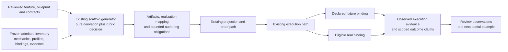

# Scaffold-generation operationalization: implementation plan

Status: proposed for team review · 2026-09-11  
Scope: extend `generate-executable-capability-scaffold` and its existing execution integration. This document specifies future work; it does not report that work as implemented or admitted.

The generator should return the smallest executable realization of a declared Input → Event → Outcome path, with an explicit account of admitted mechanics reused, simulated boundaries, unresolved obligations and evidence needed for the promised outcome. The [architecture decision rubric](sidefx-architecture-decision-rubric.md) governs how the team evaluates that choice and subsequent additions.

Generation remains a pure derivation. The existing capability execution path runs the resulting realization. This preserves the generator's declared responsibility while making its output useful sooner: first a truthful executable result, then a verified outcome with real providers wherever required.

## 1. Review scope and authority

The builder requested this implementation plan and the solidification of the rubric. The supplied proposal establishes the direction: minimum executable functionality, reuse before new mechanics, explicit simulation, provider contracts and mappings, and measured improvement across successive capabilities. This plan makes that direction concrete for team review.

The rubric's scores, the field names below and the proposed capability revisions remain proposals. They do not override admitted requirements, select a new topology, or confer permission to execute effects. No implementation, registration, managed admission, provider call or database mutation is part of preparing this document.

There are two distinct products to track during implementation:

| Product | Applicable change path |
| --- | --- |
| Revision of the existing managed scaffold generator | Resolve its exact predecessor and current contracts; follow the Harness managed revision lifecycle. Changing its declared behavior is managed work. |
| Capability produced by the revised generator | Determine whether the request is token provisioning or managed admission/revision. Keep the cheap provisioning path available; do not impose managed publication on every generated token. |

Harness lifecycle and authorship requirements come from its [AGENTS.md](../../agentic-harness/AGENTS.md), [CLAUDE.md](../../agentic-harness/CLAUDE.md) and [capability-change lifecycle](../../agentic-harness/docs/capability-change-lifecycle.md). Author declarative meaning there and project executable code through the applicable admitted mechanisms. Database registration is a separate projection/publication boundary; SQL `PUBLISHED` is not Harness managed admission.

## 2. Inspected baseline and concrete gaps

Local inspection on 2026-09-11 covered the generator feature and capsule entry inventory in `agentic-harness`, relevant database model/registration source, and the execution, validation and documentation paths in `sfx-embody` at commit `9ac315c`. It did not invoke the generator, verify managed-estate admission, query the live database or run providers. Historical run reports below are evidence of their recorded runs, not claims about today's selected generation.

| Existing responsibility | Evidence inspected | Implementation implication |
| --- | --- | --- |
| Pure generation of a standard shell, slots, evidence obligations and bounded authoring work | [Generator feature](../../agentic-harness/features/generate-executable-capability-scaffold.feature) | Extend this capability; retain supplied inventory, no external effects during generation and byte-identical replay. |
| Blueprint conditioning, candidate/admitted distinction and exact embodiment | Same feature: `condition-scaffold-on-admitted-blueprint`, `prove-blueprint-embodiment` | Preserve cells, edges, terminals, precedence, altitudes and required slots. A first realization is a binding of that design, not a replacement circuit. |
| Slot lookup and completeness | Same feature: `resolve-slots-against-admitted-estate`, `resolve-scaffold-completeness-level` | `FOUND`/`NOT_FOUND` and design completeness are insufficient to express compatibility, actual execution or verified outcomes. Add separate evidence without reinterpreting those statuses. |
| Unresolved root meaning and preserving child cells | Same feature: `preserve-semantic-transformation-as-unresolved` | The rule currently rejects a resolved root as `SEMANTIC_MEANING_FABRICATED`. Reusing a supplied admitted transformation needs an explicit feature/authority revision, not a workaround in generated code. |
| Direct database invocation and Node embodiment | [Invocation](../src/invoke-database-capability.mjs), [authority reader](../src/read-authority.mjs), [materializer](../src/materialize-node.mjs), [memory loader](../src/load-memory-scenario.mjs) | Reuse the read → plan → link → execute route. `prepare` is a separate optional proof, not an invocation prerequisite. Current delivery calls its provider `CANDIDATE_PHYSICAL_PROVIDER`; preserve that qualification. |
| Real contract projection and full catalog closure | `materialize-node.mjs` resolves required schemas and catalog `$ref` sources | Supply exact contract bytes/references. A filename or open placeholder is insufficient proof of executable contract closure. |
| Scaffold fixture execution through effect stubs | [Validator](../scripts/validate-scaffold.mjs), [equity fixtures](../scaffolds/resolve-equity-market-price-evidence/fixtures.authority.json) | There is a useful seam precedent. The validator reads the selected capability, overlays matching retained sources, and reports disk-only files without adding them. It is not yet a general proof of an entirely new capsule. |
| Versioned mechanics, providers, profiles and bindings in SQL | [Database catalog](../../../sidefx-database/src/migration/catalog.mjs) | Extend exact retrieval/projection only where data is missing; avoid a parallel mechanic catalog. Existing tables alone do not establish complete semantic coverage. |
| Schema emission and source-reproducibility defects | [Scaffold invocation report](scaffold-invocation-rapidapi.md), [schema derivation proposal](deriving-contract-schemas.md) | Recheck the catalog-without-schemas and aliased-filename defects. Repair through source bytes and the supported pipeline; do not repeat one-off row repairs. |
| Feature/version ownership remains migration work | [Canonical-feature plan](canonical-feature-migration-gap.md), [equity review](reviews/resolve-equity-market-price-evidence.md) | Pin the exact feature, selected capability revision and source set. Historical execution definitions must not be unioned into a fictitious current circuit. |

The schema derivation document remains a separate proposal: inferred schemas can assist authoring and comparison, but are not automatically admitted contracts. The generator's feature promises contract skeletons; the historical run report records that schemas were missing. Treat this discrepancy as a regression to reproduce, not as permission to weaken validation.

The source proposal referred to an execution-plan v3 artifact not supplied here. Local capsule inspection found `runtime.execution-plan.node.v2.json`. Resolve the actual supported execution-plan contract at implementation time; this plan does not assume a v3 migration.

## 3. Target behavior

Given a reviewed feature, its applicable topology/blueprint, exact contract and mechanic references, a frozen admitted inventory and explicit realization inputs, the revised generator produces:

1. The existing shell, blueprint binding/embodiment receipt, artifacts, completeness and authoring queue.
2. A minimum-realization decision recording the selected path, necessity, reuse basis, costs/unknowns and deferred obligations under the rubric.
3. A mapping for every required responsibility and slot: executable using an eligible binding, simulated at a declared seam, or unresolved. Unselected declared branches remain visible and receive coverage dispositions.
4. Resolvable contract artifacts/references, explicit semantic transformations or admitted transformation references, and fixture declarations sufficient for the selected executable path. Missing meaning remains an authoring obligation.
5. Proof obligations for input/output admission, behavior, simulation attribution, provider conformance and any promised external result.

The execution consumer subsequently validates and runs the exact artifact, retaining observations about what actually happened. Generated expected evidence is never presented as observed evidence.

This diagram describes the delivery process, not new topology inside any generated capability. The fixture and real bindings occupy the same declared seam. Registration or managed publication occurs through the applicable existing path when requested; neither is silently performed by generation.

### 3.1 Minimum executable responsibilities

| Position | First executable realization | Verification |
| --- | --- | --- |
| Input | Accept the declared data and invoke the applicable contract validator | Valid input admitted; invalid input reaches the declared failure before downstream effects. |
| Event | Execute explicit supplied semantics or reference admitted semantics; bind real eligible mechanics and explicit fixtures at remaining permitted seams | Operations retain their responsibility and order; no invented transformation, pass-through substitution or undeclared effect. |
| Outcome | Produce and validate the declared output; preserve terminal failures and holds | Schema validity plus scenario-specific assertions; simulated output identified as simulated. |
| Evidence | Retain exact source/binding identities and per-operation execution observations | Distinguish expected from observed, real from simulated, and structural proof from fulfillment of the outcome. |

For a declared read → hash → model interpretation path, reuse compatible admitted read and hash mechanics and place the fixture at the model boundary. That example is conditional on those mechanics and that seam being authorized; it does not instruct the generator to invent this circuit or imply the current estate contains every binding. A provider-free path needs no artificial provider slot. A multi-provider path retains every required provider and dependency.

### 3.2 Resolution procedure inside the existing capability

1. Validate required carrier/inventory presence, exact identities and applicable provenance through the existing authority boundary. Caller-supplied data does not become admitted merely by declaring itself admitted. Missing inventory is distinct from a supplied empty inventory. Validate contract shapes before lookup; bare strings must not silently behave like objects with missing IDs.
2. Condition on the blueprint where supplied, record candidate versus admitted status and reject contradictory loose fields. Derive obligations only from the resulting declared design.
3. For each obligation, resolve admitted precedents, contracts, effects, failure behavior, execution constraints, profiles, provider eligibility and applicable sharing scope. Record why each considered alternative does or does not close it.
4. Apply `REUSE_EXISTING` → `COMPOSE_EXISTING` → `AUTHOR_PROFILE` → `AUTHOR_NEW`. Use existing authoring-disposition/context responsibilities where their current contracts apply. Resolve equivalent alternatives using the declared selection policy; absent such a policy, retain the ambiguity. Insufficient justification or ambiguity yields `HELD`; a candidate is not admitted by ranking highly.
5. Choose the first realization within the declared topology: real eligible mechanics where available; explicitly requested fixture isolation or declared simulation at unresolved seams; otherwise an open obligation. No automatic fallback from a failed real provider to simulated success.
6. Emit the rubric decision, artifact/reference closure, realization mapping, proof obligations and the next bounded authoring queue. Preserve target requirements when a fixture enables early execution.
7. Replay generation from identical canonical inputs and frozen evidence. Keep timestamps, execution IDs and evolving measurements outside the deterministic generation digest basis. Rule changes change the generator identity and therefore the replay basis.

The [Semantic Brain](../../agentic-harness/docs/SideFX%20Semantic%20Brain.md) records this reuse ordering. Parameters reuse an existing contract; allowed specialization uses a profile; a conforming implementation changes binding; different behavior/effects/guarantees require revised or new semantic identity. This procedure must not let the generator author domain meaning or rewire composition to save effort.

### 3.3 Contract and evidence changes

The names below describe proposed information groups, not newly admitted schema IDs. First map them to existing carrier, execution-plan and receipt structures; add versioned fields only for proven gaps. Optional economic estimates may remain unknown and do not block otherwise authorized execution.

| Information group | Minimum contents | Owner |
| --- | --- | --- |
| Frozen basis | Feature/capability/scenario versions; blueprint digest/status; inventory and mechanic-catalog identities; generator/rule version; contract and supporting evidence digests; target/environment | Generation request and existing provenance structures. |
| Rubric decision | Scope/observable outcome; smallest sufficient realization; source and status of each material commitment; omission consequence; disposition/revisit trigger; benefit/burden/beneficiaries, with unknowns explicit | Generated decision record plus attributed builder/reviewer inputs. |
| Reuse resolution | Required mechanic identity/version; precedent/disposition; parameter/profile/composition/binding references; compatibility and permission evidence; rejected candidates and reasons | Existing slot resolution extended with evidence. |
| Realization mapping | Declared scenario/operation/slot reference; intended mechanic; chosen real or fixture binding or open status; reason, target gap and required promotion evidence | Existing scaffold/execution-plan structures; no second authoritative circuit. |
| Provider seam | Capability I/O references; provider request/response references; request/response transformation references; configuration/credential references; effect and failure policy; fixture/real binding identity | Declared ports, transformation authorities and bindings. Live secrets are never embedded in a fixture or decision receipt. |
| Semantic closure | Promise, inputs/results, failure behavior, effects, constraints and references to profiles, bindings, evidence and sharing scope | Semantic transformation authority and linked authoritative definitions; do not duplicate all metadata into an ungoverned record. |
| Observed run evidence | Run and artifact identities; input/result digests; operations executed; fixture identities; contract and behavioral assertion results; provider/effect testimony; unresolved obligations and claim scope | Execution consumer, after execution. Generation emits obligations only. |

A generic mechanic and its proprietary implementation can have different sharing scopes. A domain-specific mechanic can be shareable inside an enterprise. Preserve semantic applicability and permission independently; absence of permission evidence is not a public-sharing default.

Capability input/output must not be copied blindly into provider request/response contracts. Mappings must cover additional provider configuration, transport envelopes, malformed responses and declared failures. Simulate the provider response at the same port/effect boundary used by a real provider, then run the same mapping and outcome checks.

### 3.4 Status and claim semantics

Retain existing `SCAFFOLD_READY`/`HELD`, completeness levels, kernel dispositions, provisioning status and managed status. Add orthogonal realization/evidence information under reviewed contracts. No single new status is allowed to erase these distinctions.

| Situation | Truthful reporting |
| --- | --- |
| Shell generated; target semantics or schema missing | Generation may complete; target remains non-executable with exact open obligations. |
| Fixture path executes and validates | Simulated execution demonstrated; required real-provider/behavioral evidence remains open. This cannot satisfy target slot readiness by itself. |
| Real mechanics run but one required seam is simulated | Mixed realization; list each executed/simulated obligation. Aggregate outcome claim retains the simulation limitation. |
| Real provider returns success but semantic validation fails | Provider exchange observed; capability outcome rejected/failed according to its declared terminal. |
| Provider-free transformation passes required behavioral assertions | A real outcome may be established without provider evidence; report actual proof scope. |
| All obligations for a provider-backed result are evidenced | Scoped operational outcome established; unrelated scenarios and managed admission remain separate. |

Do not assert that schema validation proves a booking, write, payment or other external effect. Tests can carry success-shaped payloads while the run evidence clearly says no real external outcome was established. For a required external effect, retain the feature's actual confirmation/postcondition evidence before making that claim.

## 4. Implementation sequence and ownership

Owners below are responsibilities for assignment at review, not presumed people or staffing commitments. Sequence is dependency-based; estimates and dates should follow the first inventory. Each increment has a reviewable deliverable.

Release independently eligible changes as soon as their own proof and lifecycle obligations close. The generator's publication must not wait for an unrelated pilot provider or a second delivery example. Increment 5 accounts for release completion and repetition; it is not a new gate delaying publication. Likewise, full-estate migration and generalized schema inference are not prerequisites for a pilot whose exact required closure is already valid.

### Increment 0 — pin the current change boundary

**Owner:** capability author with database/runtime maintainer.

- Resolve the current generator's exact predecessor, canonical feature, capsule, contracts, execution plan and applicable lifecycle. Compare selected retained bytes with the inspected local feature before revising anything.
- Reproduce plain and blueprint-conditioned generation from the existing [requests](../examples/rapidapi-scaffold.request.json) and [blueprint request](../examples/rapidapi-scaffold-blueprint.request.json). Retain outcomes, unresolved queues, schema references and replay evidence; do not call the target provider during generation.
- Check which declared mechanics already have executable bindings and which semantic/permission/conformance fields survive retrieval. Distinguish missing definitions, missing implementations, ambiguous selection and incompatible implementations.
- Select and pin the equity pilot described in section 6, including a declared provider seam. Record canonical-feature conflicts and the smallest source repair required.

**Exit:** exact change manifest, reproduced baseline, scoped gap list and a decision record using the rubric. Missing economic forecasts do not hold this exit. An unresolved authority conflict holds only dependent work.

### Increment 1 — revise the declarative generator contract

**Owner:** generator capability author and semantic authority reviewer.

- Revise the canonical feature, conditioned blueprint and supporting contracts through the existing managed revision path. Resolve the supported execution-plan version; do not bump it merely to match a historical attachment.
- Extend `resolve-slots-against-admitted-estate`, `emit-next-bounded-authoring-obligation`, `emit-mechanical-authoring-artifacts` and completeness reporting with the information in section 3. Add scenarios only where a distinct responsibility requires them and have that topology admitted through its existing owner.
- Replace the unconditional unresolved-root rule with a precise rule: bind supplied admitted semantics with exact provenance; retain genuinely missing semantics as unresolved; permit explicit fixture realization at declared seams without claiming it supplies target semantics. Preserve rejection of invented business meaning.
- Include an authored execution/fixture realization only where its authority applies. Preserve candidate conditioning and cheap provisioning; do not require target managed admission merely to generate testimony.
- Version incompatible request/outcome changes. Define how old requests are accepted without claiming the new proof, or rejected with a clear version diagnostic. Never silently relabel an old fixture as real execution.

**Exit:** reviewed declarative delta, concrete request/outcome examples and fixtures covering semantic reuse, unresolved meaning, topology preservation and truthful status. The managed lifecycle owns required approval/admission; the rubric creates no additional admission service.

### Increment 2 — make one generated path executable

**Owner:** generator author and embodiment maintainer.

- Resolve admitted precedents and generate the mechanic realization using the ordering in section 3.2. Bind compatible mechanics by exact reference; reuse the admitted contract validators rather than generating bespoke validators.
- Emit or retain resolvable schemas for every required catalog entry and transitive `$ref`. Distinct contract IDs must resolve to their intended schema identities without accidental filename collision. Deterministic schema-path encoding must preserve a reverse mapping to the original ID.
- Keep inferred skeletons clearly incomplete until applicable contract authority supplies required meaning. A skeleton that accepts everything is not completion. Do not make the broader schema-inference proposal a prerequisite when the pilot already has suitable contracts.
- Emit fixture cases and an execution mapping at declared seams. Keep all target mechanics and branch obligations visible even when the first fixture exercises one route.
- Validate the exact candidate source/capsule closure. Address the current validator's selected-estate overlay limitation: use the applicable capsule-owned proof boundary for new candidates, or extend the validator to assemble and check all candidate-owned sources and closure. Reporting new files without planning them cannot count as proof.

**Exit:** one generated candidate has valid contract closure and a passing simulated execution with operation-level attribution. Missing fixture authority, zero assertions, missing candidate sources or an unexecuted promised transformation cannot produce a full validation claim.

### Increment 3 — preserve meaning through SQL and runtime delivery

**Owner:** database and embodiment maintainers; CLI maintainer for presentation.

- Map each required field to existing authoritative bytes, normalized mechanic/port/provider/profile/binding rows and qualification evidence. Extend [catalog](../../../sidefx-database/src/migration/catalog.mjs), [schema](../../../sidefx-database/src/migration/schema.mjs) and [views](../../../sidefx-database/src/migration/views.mjs) only for demonstrated projection gaps.
- Carry exact semantic versions, feature ownership, contract references, allowed effects, profiles, sharing constraints and provider compatibility through the selected model. Reject mixed generations, ambiguous versions, missing/truncated authority and conflicting blueprint bindings.
- Use the supported [registration path](../../../sidefx-database/src/register/capability.mjs) for authored capsule bytes, with validation. Coordinate canonical-feature bindings with the [feature migration](canonical-feature-migration-gap.md). Prove the pilot's exact binding before its database invocation; the full estate backfill remains that migration's work.
- Extend `read-authority.mjs`, `materialize-node.mjs`, the Node resolver and `invoke-database-capability.mjs` only as needed to consume the revised contracts and emit actual realization evidence. Retain direct in-memory invocation and existing generation-coherence checks. Use current constrained effect bindings for real/fixture execution; never choose mock behavior by an unvalidated CLI flag.
- Keep the agent/CLI entry through the deterministic capability layer. Return missing mechanics and bounded authoring obligations when resolution cannot close. Do not introduce a handwritten product script as an automatic fallback.

**Exit:** the exact generated revision round-trips through supported registration/retrieval and executes with the same semantic obligations and explicit fixture labels. JSON and human-facing output expose held/open states. SQL availability adds no authority and no blanket statement that code runs inside SQL Server; the inspected invocation path executes Node bodies from database-retained authority.

### Increment 4 — replace the fixture binding and verify the outcome

**Owner:** provider integration maintainer and capability owner.

- Select a compatible real binding at the same declared seam. Validate request/response mappings, configuration and execution permission; retain the target semantic identity and topology when the promise is unchanged.
- Prove provider-specific failures relevant to the declared contract: unavailable credentials, denied access, timeout/unavailability, malformed/partial response, and successful transport with an invalid domain result. Test only effects required by the chosen pilot.
- Run the same capability through the supported invocation path. Retain real provider testimony and the outcome's behavioral assertions. Do not replay effects to test reproducibility where a frozen observation suffices.
- If no eligible provider is available, preserve the passing simulated milestone and the precise real-binding obligation; do not report operational completion. The work remains incomplete against this increment's exit.

**Exit:** first behaviorally verified provider-backed outcome for the pilot, with real and simulated runs visibly distinguishable and their unchanged semantic basis demonstrated. A binding that changes promised behavior returns to semantic revision instead of being accepted as substitution.

### Increment 5 — account for release completion and measure repetition

**Owner:** generator change owner, runtime/database release owners and team reviewer.

- Confirm completion of the generator's applicable managed lifecycle, dependent projection/registration releases and required observation of the exact published revision; close any still-dependent work. A green local fixture or database registration alone does not close managed work.
- Exercise a second comparable scaffold from the revised generator. Reuse the first pilot's applicable contracts, mappings, mechanic references and evidence patterns; record additional semantics honestly.
- Attach delivery and maintenance observations to the initial rubric predictions. Record adoption/requested rubric changes in this document's review table.

**Exit:** managed generator revision complete in its owning estate, database/runtime integration verified, both pilot records retained and the measured second cycle available for review. If a second example has not run, functional delivery and flywheel validation must be reported separately; the latter remains open.

## 5. Acceptance and regression evidence

Use focused declarative fixtures for capability meaning and focused tests for physical projection/delivery changes. Do not invent a new test framework. Extend the existing Node resolver/database tests where those implementations change; use the Harness's admitted proof mechanisms for its capability revision.

| Case | Required evidence |
| --- | --- |
| Plain versus blueprint-conditioned request | Existing absence/conditioning behavior preserved; no contradictory loose fields override the blueprint. |
| Frozen request replay | Byte-identical generated product under the same rules, authority and inventory; observed runtime timestamps remain outside this comparison. |
| Missing/malformed inventory | Unsupplied inventory distinguished from empty; malformed entries rejected instead of yielding plausible `NOT_FOUND` results. |
| Same label, incompatible mechanic | Schema, effect, failure, profile or permission mismatch prevents reuse; exact reason retained. |
| Reuse/profile/binding/identity cases | Parameters and conforming binding preserve meaning; specialization has applicable profile authority; changed guarantees route to revision/new identity. |
| Zero, one and multiple required providers | No invented provider for a pure circuit; no dropped provider for composed circuits. Test additional shapes with bounded fixtures. |
| Root transformation available versus absent | Exact admitted meaning reused; missing meaning stays open; preserving cells cannot discharge an unrelated responsibility. |
| Missing/aliased schemas and transitive references | Candidate fails with exact missing/conflicting reference; valid unique references complete the contract closure. |
| Invalid capability input | Declared rejection and no unintended downstream effect. |
| Provider seam differs from capability I/O | Real mapping executes for fixture and provider paths; invalid request/response envelopes reach declared failures. |
| Mixed execution | Available eligible mechanics actually run; only declared seams simulate; target unresolved slots remain visible. |
| Simulated success-shaped output | Valid contract/fixture assertions pass while external-outcome proof remains unestablished in evidence and display. |
| Real provider failure | No silent mock fallback, success relabeling or loss of failure testimony. |
| Blueprint/topology fidelity | Every declared node/edge/terminal/slot accounted for, no undeclared executable topology; changed topology returns to design authority. |
| Candidate proof fidelity | All exact candidate-owned artifacts included; no fallback to stale retained files; no zero-fixture or zero-behavioral-assertion success claim. |
| SQL round trip and revision isolation | Exact selected feature/capability/scenario/contract/binding versions survive; stale generation, cross-owner or mixed-version resolution rejected. |
| Consumer compatibility | Prior request behavior preserved under supported versions; new evidence not inferred for legacy runs; both JSON and visible output retain holds and simulation scope. |

Existing anchors include `npm test`, [scaffold validation](../scripts/validate-scaffold.mjs) and the direct invocation examples. These are implementation verification targets, not tests run while writing this plan. Invoke effectful cases only under the pilot's declared execution authority and configured binding. Broader proofs run at the lifecycle stage that owns their claim.

## 6. First pilot and measurements

Use `resolve-equity-market-price-evidence` as the default first pilot because the repository already carries scaffold inputs, provider-shaped fixtures, contract artifacts and historical invocation evidence. Its conflicting retained revisions make exact source selection an explicit entry task. Do not reconstruct a circuit by joining every historical execution authority.

The first milestone executes its declared transformations with a frozen provider response at the governed effect seam, validates the contracts and labels the observation simulated. The next milestone binds an eligible real quote provider and proves the declared market-evidence result. A fixture credential reader is still simulated; do not describe the entire path as real merely because normalization ran.

For live market data, compare declared stable invariants and required fields. Use frozen payloads for exact output comparisons. Do not demand byte-identical prices or timestamps across live calls. This follows the observed limitation in the [scaffold invocation report](scaffold-invocation-rapidapi.md), not an assumption about a provider's current API.

Choose the second pilot during increment 0 as the next actual team need with a comparable provider/transformation seam. Record its identity then. A synthetic extra case can prove a contract branch, but cannot stand in for another useful delivery cycle or user adoption.

| Measure | Collection rule |
| --- | --- |
| Time to first simulated execution | Elapsed time and engineering effort from scoped start; include source reconciliation, review and validation overhead. |
| Time to first verified outcome | Separate timestamp/effort for the real outcome; identify provider-backed or provider-free proof and any external waiting time. |
| Mechanics reused | Exact distinct admitted mechanic identities/versions and bindings; also show obligations covered. Do not inflate the count with repeated calls or fixtures. |
| New work and maintenance | New/revised semantic identities, profiles, adapters, contracts and recurring engineering/operational burden, with owners. |
| Execution quality | Authorized successes/attempts by real versus simulated mode; failure reasons and distinct actual users. |
| Repetition effect | Effort of the next comparable useful example and which reuse caused the difference; report scope differences. |
| Distribution | Who saved time, who authored extra material, who operates it and who bears failures. |

No numerical improvement target is asserted before a baseline or builder target exists. Keep forecasts beside observations; unknown values stay unknown. Use the rubric's break-even calculation only when relevant inputs can credibly be expressed in engineering hours.

## 7. Initial architecture decision record

Scope anchor: one useful executable scaffold followed by its verified outcome, preserving declared meaning and reducing repeated authoring through admitted reuse. First-delivery and repetition effects below are hypotheses until measured.

| Decision and source | Authority/status and present need | Expected benefit and burden | Disposition / revisit |
| --- | --- | --- | --- |
| Extend the existing pure generator (sections 2–3) | Existing feature boundary plus this implementation proposal; makes the decision inspectable without effectful generation | Reuses shell/slot machinery; adds carrier and proof maintenance borne by generator maintainers | Needed now for this direction; preserve purity. |
| Permit exact admitted semantic reuse (increment 1) | Proposed managed revision of the unconditional unresolved-root rule; current rule otherwise blocks this reuse | Less repeated authorship; provenance and compatibility checks add work | Needed now; unresolved/new meaning still uses its authoring path. |
| Keep realization and outcome evidence separate (3.3–3.4) | Builder's supplied direction; prevents fixture success from claiming an external outcome | Credible early execution; runtime/display attribution costs | Needed now; measure whether evidence remains understandable. |
| Resolve reuse before new identity (3.2) | Semantic Brain precedent, scoped to applicable current authorities | Lower repetition cost; qualification/retrieval cost | Needed now; measure decision overhead and actual reuse. |
| Complete required schema references (increment 2) | Existing materializer needs contract closure; historical generator defect | Removes manual gap for known schemas; source/validation work | Needed now for pilot contracts; generalized schema inference deferred until measured authoring need. |
| Preserve semantic links through existing SQL model (increment 3) | Current database delivery plus builder's estate-wide reuse direction | Shared retrieval; mapping and version-compatibility maintenance | Needed for integration; add only fields with a demonstrated gap. |
| Separate managed generator revision from generated-token provisioning (section 1) | Existing Harness lane rules | Preserves cheap execution; requires explicit status presentation | Needed now; do not impose managed publication on every token. |
| Build a separate rubric service or universal optimizer | No demonstrated present dependency | Possible later automation; extra service and speculative complexity | Defer until the existing capability demonstrably cannot carry decisions. |
| Add diagram UI, broad provider catalog or all-runtime support before the pilot | Outside this bounded generator implementation slice | Broader reach; delays first evidence and adds owners | Defer to an actual consumer/runtime requirement. Preserve the original diagram experience when that work is scoped. |

The rubric records necessity, benefits, burdens and beneficiaries. Its optional scores do not choose semantic identity, authorize effects or replace existing conformance rules.

## 8. Compatibility, release and recovery

- Retain exact predecessor contracts, capsules and evidence while introducing the revised generator. Make request/outcome version handling explicit and keep the deterministic digest basis documented.
- Rebuild from authoritative source bytes through the supported managed and database paths. No in-place edits to published semantic history, capsule manifests or content digests to make the new result appear current.
- Coordinate generator, database projection and runtime reader compatibility before selection. If the new consumer contract is not supported, keep the compatible selected revision available and report the concrete incompatibility.
- Use the owning systems' supported selection/release recovery paths. The [canonical-feature plan](canonical-feature-migration-gap.md#8-idempotency-cutover-and-rollback) records that a general database rollback selector still needs proof; do not assume `source.publish_model` can reselect any published generation. Prove the needed recovery before cutover.
- Recovery restores a compatible selected revision and preserves evidence. It does not undo an already executed external effect or convert a failed provider run into a fixture success.

## 9. Team review disposition

The team can review a concrete proposal without first resolving every optional metric or later provider. Record decisions here; route actual authority changes through their existing owner.

| Review item | Proposed position | Disposition |
| --- | --- | --- |
| Capability boundary | Pure generation plus existing execution consumer; explicit managed revision for semantic reuse | Pending team review. |
| Rubric adoption | Use the linked rubric for this slice and later material decisions; retain proposal/source status and observed feedback | Pending team review. |
| Contract design | Map section 3.3 to existing structures, version only demonstrated gaps; preserve all existing status dimensions | Pending team review. |
| Pilot | Equity evidence after exact source/feature reconciliation; name a real second use during increment 0 | Pending team review. |
| Ownership and schedule | Assign generator, semantic review, database, runtime and provider owners; estimate after the baseline is reproduced | Unassigned. |

Record reviewer, date, accepted scope, requested changes and source references when the review occurs. Completion requires the increment exit evidence, not merely acceptance of this document.
