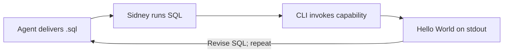

# SQL → CLI: scaffold Hello World

2026-09-12 · Work order · End-to-end execution not yet demonstrated

**Goal:** Sidney runs a complete `.sql` file to create an executable Hello World capability, then invokes it through the existing CLI. Capability meaning and changes come entirely from the database.

**Hard requirement — human execution:** The agent delivers the SQL; Sidney alone executes all scaffold creation, registration, updates, and database repairs. The agent must not execute these writes, including rollback experiments. No Node/`.mjs` registration or import helper, including `src/cli.mjs`, may install the scaffold. Previously generated files must not substitute for the SQL. The existing CLI is used only to invoke the capability afterward.

**The only flywheel:** Human-run SQL → CLI execution → observed output → human-run SQL change → repeat. Reuse the same SQL to scaffold another capability.

**Scenario:** Empty request → write the database-defined message through standard output → the caller sees Hello World.

**Start with executable evidence:** Trace an existing executable capsule through its database authority, mechanics, bindings, and invocation. Complete the existing `scaffold-hello-world.sql` using that pattern, including missing provider bindings. Read-only investigation and SQL preparation belong to the agent.

| Work | Observable proof |
| --- | --- |
| Sidney runs the scaffold SQL | Verification SELECTs show capability/scenario, feature/Gherkin, contracts, execution authority, mechanic and provider binding. |
| Invoke the generated capability | Actual stdout contains the stored message; execution evidence identifies the standard-output call. |
| Sidney changes and restores the message using SQL | The unchanged CLI/runtime prints the changed message, then the restored original. |
| Sidney reruns the scaffold SQL for another identity | The second capability executes through the unchanged CLI/runtime. |

**Mechanic:** Write supplied text to stdout. Database data supplies the message and binding. Reuse the existing execution path. CLI diagnostic logging does not prove the capability invoked stdout.

**Transaction:** The `.sql` wraps changes in a transaction, displays verification SELECTs, and defaults to rollback with commit commented out. Sidney explicitly selects commit to install the records before a separate CLI invocation. Rolled-back records are not installed.

**Scorecard:** Proposed contribution **3/3**. End-to-end evidence **0/2**—not yet demonstrated. Completion targets: **4/4** observed checks, **0** external source edits, **0** managed-promotion prerequisites. Record minutes and human steps for the first scaffold and its repeat; savings remain unmeasured.

**Blocker evidence:** Identify the working example and specific constraint preventing a SQL solution. Use Sidney's SQL results and subsequent invocation results to substantiate execution failures. Missing binding data is work to complete; awaiting human execution is a status. Include any necessary workshop repairs in the delivered SQL. Promotion-only requirements must not block this loop.

**Deliver now:** Complete `scaffold-hello-world.sql` and exact invocation commands. Record actual outputs after Sidney runs the SQL; until then, execution evidence remains pending. Supporting analysis stays separate.
