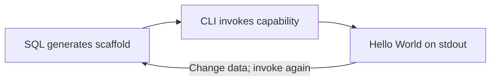

# SQL → CLI: scaffold Hello World

2026-09-12 · Work order · End-to-end execution not yet demonstrated

**Goal:** Generate a Hello World capability through SQL and invoke it through the existing CLI. Capability meaning and changes come entirely from the database.

**The only flywheel in scope:** SQL scaffold → CLI execution → observed output → SQL change → repeat. Standardize the successful SQL into a reusable scaffold operation; a stored procedure may package it.

**Scenario:** Empty request → write the database-defined message through standard output → the caller sees Hello World.

| Work | Command-line proof |
| --- | --- |
| SQL creates the scaffold | Read back capability/scenario, feature/Gherkin, contracts, execution authority, mechanic declaration/reference and stdout-provider binding. |
| Invoke the generated capability | Actual stdout contains the stored message; execution evidence identifies the standard-output call. |
| Change and restore the message using SQL only | The unchanged CLI/runtime prints the changed message, then the restored original. No capability-specific source file participates. |
| Repeat the same scaffold operation | A second capability identity is created and invoked with the same SQL operation and unchanged CLI/runtime. |

**Mechanic:** Write supplied text to stdout. The generic provider implements the write; database data supplies the message and chooses the operation. CLI dispatch and diagnostic logging must not substitute for that call. Reuse an existing stdout implementation; its availability is not yet verified. Report a missing implementation rather than hardcoding Hello World.

The runtime must consume the exact working data. Establish how it receives SQL edits before claiming the loop works. Rollback undoes database changes, not text already emitted.

**Scorecard:** Proposed contribution **3/3**—this is the requested loop. End-to-end evidence **0/2**—untested. Completion: **4/4** observed checks, **0** external source edits, **0** managed-promotion prerequisites. Record minutes and human steps for the first scaffold and its repeat; savings remain unmeasured.

**Blockers:** Name each database constraint blocking this example. Remove or relocate promotion-only requirements from the workshop; justify retained restrictions by this loop's execution needs. Limit changes to blockers actually encountered.

**Deliver:** Reusable SQL scaffolding commands, exact CLI commands, actual outputs, and the scorecard. Supporting analysis stays separate.
